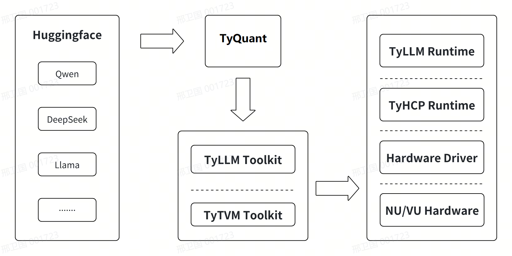

# 更新说明

本文记录了``Edge10``系列大模型工具链的变更情况。

**20251128/v1.1.7**

- 🚀v1.1.7正式版本发布
- 🚀独立的量化工具镜像
- 🚀独立的编译工具镜像
- 🚀更新大模型支持列表
- 🚀更新量化工具使用说明
- 🚀更新编译工具使用说明

**20250414/v1.0.8**

- 🚀优化``Qwen2.5-VL-7B`` ``ViT``部分性能

**20250320/v1.0.6**

- 🚀新增支持``Qwen2.5-VL-7B``模型``3Die``编译

**20250305/v0.0.2**

- 🚀新增支持``Qwen2.5-VL-7B``模型``4Die/1Die``编译


<br>

# 整体介绍

``TyQuant``为云天励飞大模型量化工具，用户可通过本工具或其它开源量化工具对大模型完成量化；``TyLLM``是云天励飞推出的大模型工具链，可帮助用户将大模型编译为``Edge10``系列芯片上执行的模型。``TyLLM``为云天基于``TyTVM``工具链针对大模型增量开发的工具，主要基于``PyTorch``和``vLLM``对大模型做专属和定制优化；``TyTVM``为云天模型转换、量化、仿真、编译工具链，主要负责将模型编译为芯片执行的模型。

### 整体架构如图：

<div style="text-align:center;">
  
</div>

### 支持模型列表

已经支持的模型如下（包括不限于）：

| Model                                        | Quant Support | Compile Support |
| :------------------------------------------- | :-----------: | :-------------: |
| Qwen/Qwen3-VL-8B                             |      ✅       |       ✅        |
| Qwen/Qwen3-VL-4B                             |      ✅       |       ✅        |
| Qwen/Qwen3-4B                                |      ✅       |       ✅        |
| Qwen/Qwen3-1.7B                              |      ✅       |       ✅        |
| Qwen/Qwen2.5-VL-7B                           |      ✅       |       ✅        |
| Qwen/Qwen2.5-VL-3B                           |      ✅       |       ✅        |
| Qwen/Qwen2-VL-7B                             |      ❌       |       ✅        |
| Qwen/Qwen2-7B                                |      ❌       |       ✅        |
| Qwen/Qwen1.5-1.8B                            |      ❌       |       ✅        |
| deepseek-ai/DeepSeek-R1-Distill-Qwen-1.5B    |      ❌       |       ✅        |
| deepseek-ai/DeepSeek-R1-Distill-Qwen-7B      |      ❌       |       ✅        |
| deepseek-ai/DeepSeek-R1-Distill-Qwen-32B     |      ❌       |       ✅        |
| Llama3-8B                                    |      ❌       |       ✅        |
<br>

# 快速开始

本节介绍使用``TyLLM``工具链前的开发环境准备工作。``TyLLM``使用``Docker``容器进行工具链集成，用户可通过``Docker``加载``TyLLM``镜像文件，然后进行模型量化、编译、评估(未来)等工作，因此开发环境准备阶段需要正确安装``Docker``环境，同时目前需要量化阶段需要``GPU``来加速，以及多模态模型的编译依赖``vLLM``框架来推理，因此暂时需要``GPU``。

## 环境准备

- **Nvidia GPU**
- **Nvidia Container Toolkit**
- **Docker>19.03**

### 安装Nvidia GPU 驱动

```shell
sudo apt install nvidia-driver-530 # 驱动版本尽量选择最高
# 安装完成后，执行nvidia-smi命令显示如下，表示安装成功。
+---------------------------------------------------------------------------------------+
| NVIDIA-SMI 535.179                Driver Version: 535.179      CUDA Version: 12.2     |
|-----------------------------------------+----------------------+----------------------+
| GPU  Name                 Persistence-M | Bus-Id        Disp.A | Volatile Uncorr. ECC |
| Fan  Temp   Perf          Pwr:Usage/Cap |         Memory-Usage | GPU-Util  Compute M. |
|                                         |                      |               MIG M. |
|=========================================+======================+======================|
|   0  NVIDIA GeForce RTX 3090        On  | 00000000:84:00.0 Off |                  N/A |
| 30%   27C    P8              23W / 350W |      3MiB / 24576MiB |      0%      Default |
|                                         |                      |                  N/A |
+-----------------------------------------+----------------------+----------------------+
                                                                                         
+---------------------------------------------------------------------------------------+
| Processes:                                                                            |
|  GPU   GI   CI        PID   Type   Process name                            GPU Memory |
|        ID   ID                                                             Usage      |
|=======================================================================================|
|  No running processes found                                                           |
+---------------------------------------------------------------------------------------+
```

### 安装Docker

```shell
sudo apt install docker.io
sudo docker -v
# Docker version 20.10.21, build 20.10.21-0ubuntu1~20.04.2
```

### 安装Nvidia Container Toolkit

添加包仓库和``GPG key``:
```shell
distribution=$(. /etc/os-release;echo $ID$VERSION_ID) \
    && curl -fsSL https://nvidia.github.io/libnvidia-container/gpgkey | sudo gpg --dearmor -o /usr/share/keyrings/nvidia-container-toolkit-keyring.gpg \
    && curl -s -L https://nvidia.github.io/libnvidia-container/$distribution/libnvidia-container.list | \
             sed 's#deb https://#deb [signed-by=/usr/share/keyrings/nvidia-container-toolkit-keyring.gpg] https://#g' | \
             sudo tee /etc/apt/sources.list.d/nvidia-container-toolkit.list
```

更新源，安装nvidia-container-toolkit

```shell
sudo apt update
sudo apt install nvidia-container-toolkit
```

### 安装TyQuant量化工具

量化工具镜像获取途径如下，请务必将``${version}``替换为实际对应的版本号，比如``v1.0.2``：

```shell
sudo docker login 113.100.143.90:8091 -u custom -p DE@sz_intellif_2021
sudo docker pull 113.100.143.90:8091/edgex/tyquantize:${version}
```

### 启动量化工具镜像

以下命令创建容器，其中``${your_data_dir}``表示宿主机中用户数据目录，``${version}``需改为实际版本``tag``。
```shell
sudo docker run --gpus all -v ${your_data_dir}:/data -it 113.100.143.90:8091/edgex/tyquantize:${version} bash
```

### 安装TyLLM工具链

编译工具链获取途径如下，请务必将``${version}``替换为实际对应的工具链版本号，比如``v1.1.7``：

```shell
sudo docker login 113.100.143.90:8091 -u custom -p DE@sz_intellif_2021
sudo docker pull 113.100.143.90:8091/edgex/tyllm:${version}
```

### 启动工具链镜像

以下命令创建容器，其中``${your_data_dir}``表示宿主机中用户数据目录，``${version}``需改为实际版本``tag``。
```shell
sudo docker run --gpus all -v ${your_data_dir}:/data -it 113.100.143.90:8091/edgex/tyllm:${version} bash
```

> **注意**
> 
> 需要将``113.100.143.90:8091``加入``/etc/docker/daemon.json``中的``insecure-registries``字段中，如下：
> 
> ```json
> {     
>      "insecure-registries": ["113.100.143.90:8091"]
> }
>  ```
> 修改后，重启``docker``生效，``sudo systemctl restart docker``


## 模型量化

建议使用带GPU的主机加快量化速度。

### 量化示例1-LLM模型

以Qwen3-1.7B为例，目前暂时仅支持AWQ方式量化
   ```python
   import torch
   from transformers import AutoModelForCausalLM, AutoTokenizer
   from quant_toolchain import (
       get_awq_config,
       get_dataloader,
       quantize_model,
       save_quantized_model,
   )
   from datasets import load_dataset

   # 准备模型
   org_model_path = "Qwen3-1.7B"
   dst_model_path = "Qwen3-1.7B-AMTC-AWQ"
   model = AutoModelForCausalLM.from_pretrained(org_model_path, torch_dtype=torch.float16)
   tokenizer = AutoTokenizer.from_pretrained(org_model_path)

   # 准备校准数据（可替换为自有数据）
   dataset = load_dataset("cnn_dailymail", name="3.0.0", split="train")
   dataloader = get_dataloader(
       dataset,
       tokenizer,
       num_max_orig_samples=128,
       max_sequence_length=512,
       column="article",
       concat_data=True,
       pad_to_max_length=False,
   )

   # 配置量化超参并生成量化模型
   quant_config = get_awq_config()
   quantized_model = quantize_model(model, quant_config, dataloader, tokenizer)

   # 保存量化模型
   save_quantized_model(quantized_model, dst_model_path)
   ```

### 量化示例2-VLM模型

以Qwen2.5-vl-7B为例，目前暂时仅支持VLM多模态模型的language mdoel的AWQ方式量化，visual model的AWQ量化暂时不支持。

   ```python
    import os
    import torch
    from transformers import AutoModelForCausalLM, AutoTokenizer, AutoProcessor, AutoModelForImageTextToText
    from quant_toolchain import quantize_model, save_quantized_model, load_quantized_model
    from quant_toolchain.configs.dataset_utils import get_dataloader
    from quant_toolchain.configs.get_config import get_awq_config
    from accelerate import infer_auto_device_map
    from accelerate.big_modeling import dispatch_model
    from datasets import load_dataset, load_from_disk

    MODEL_PATH = "Qwen/Qwen2.5-VL-7B-Instruct"

    SAVE_PATH = "quantized_models/Qwen2.5-VL-7B-Instruct-AMTC-LM-AWQ"
    
    if not os.path.exists(SAVE_PATH): 
        os.makedirs(SAVE_PATH) 
        print(f"目录 {SAVE_PATH} 已创建")
    else:
        print(f"目录 {SAVE_PATH} 已存在")
    model = AutoModelForImageTextToText.from_pretrained(MODEL_PATH, torch_dtype=torch.float16) 
    tokenizer = AutoTokenizer.from_pretrained(MODEL_PATH)
    processor = AutoProcessor.from_pretrained(MODEL_PATH)
    messages = [
        {
            "role": "user",
            "content": [
                {
                    "type": "image",
                    "image": "https://qianwen-res.oss-cn-beijing.aliyuncs.com/Qwen-VL/assets/demo.jpeg",
                },
                {"type": "text", "text": "Describe this image."},
            ],
        }
    ]
    # 如不使用gpu机器量化，这里to("cuda")改成to("cpu")
    inputs = processor.apply_chat_template(
        messages,
        tokenize=True,
        add_generation_prompt=True,
        return_dict=True,
        return_tensors="pt"
    ).to("cuda")

    device_map = infer_auto_device_map(model, offload_buffers=True)
    print("device_map:", device_map)
    dispatch_model(model, device_map=device_map, offload_buffers=True)

    with torch.no_grad():
        generated_ids = model.generate(**inputs, max_new_tokens=64, do_sample=False)
    generated_text = tokenizer.batch_decode(generated_ids, skip_special_tokens=True)
    print("generated_text:")
    print(generated_text[0])
    model = model.cpu()

    llm_model = model.language_model
    # 以cnn_dailymail数据集为例，可以替换为其它代表性数据
    dataset = load_dataset("cnn_dailymail", name="3.0.0", split="train")
    dataloader = get_dataloader(dataset, 
                                tokenizer,
                                max_sequence_length = 512,
                                column = "article", 
                                concat_data = True, 
                                pad_to_max_length = False,
                                num_max_orig_samples=128)

    quant_config = get_awq_config(apply_clip=True)    
    # 对语言模型进行量化
    quantized_model = quantize_model(llm_model, quant_config, dataloader)
    device_map = infer_auto_device_map(model, offload_buffers=True)
    print("device_map:", device_map)
    dispatch_model(model, device_map=device_map, offload_buffers=True)

    with torch.no_grad():
        generated_ids_0 = model.generate(**inputs, max_new_tokens=64, do_sample=False)
    generated_text_0 = tokenizer.batch_decode(generated_ids_0, skip_special_tokens=True)
    print("generated_text_0:")
    print(generated_text_0[0])
    # 保存量化模型
    save_quantized_model(model, SAVE_PATH, tokenizer)

   ```
   

   
### 格式转换
量化完成后需执行以下命令进行格式转换。  
   ```shell
   python3 checkpoint_convert.py --src quantized_model_path --dst coverted_model_path --quant_type awq
   ```
完成转换后即可进行模型编译或精度评估。

### 精度评估
- EvalScope官方链接：
    https://evalscope.readthedocs.io/zh-cn/latest/index.html
- 安装与依赖：  
   - vllm 0.11.0 安装
      ```shell
        conda create -n vllm python=3.10
        conda activate vllm
        pip install vllm
      ```
   - EvalScope安装
      ```shell
        conda create -n evalscope python=3.10
        conda activate evalscope
        pip install 'evalscope[all]'
      ```
#### LLM模型评估

- 启动vllm模型(Qwen3-1.7b为例)：
    - 浮点模型启动
      ```shell
        export LLM_USE_MODELSCOPE=True 
        export CUDA_VISIBLE_DEVICES=0,1
        python -m vllm.entrypoints.openai.api_server \
        --model Qwen3-1.7b \
        --served-model-name qwen3 \
        --trust-remote-code \
        --dtype float16 \
        --max-model-len 8196 \
        --gpu-memory-utilization 0.5 \
        --max-num-seqs 16 \
        --port 8000
      ```
    - 量化模型启动
      ```shell
        export LLM_USE_MODELSCOPE=True 
        export CUDA_VISIBLE_DEVICES=2,3
        python -m vllm.entrypoints.openai.api_server \
        --model Qwen3-1.7b-AMTC-AWQ \
        --quantization awq \
        --served-model-name qwen3_awq \
        --trust-remote-code \
        --dtype float16 \
        --max-model-len 8196 \
        --gpu-memory-utilization 0.5 \
        --max-num-seqs 16 \
        --port 8001
      ```
- 启动模型评估脚本(Qwen3-1.7b为例):
    - 模型评估脚本启动：
      ```python
      from evalscope import TaskConfig, run_task

      # 以浮点模型为例，量化模型需修改model和api_url端口
      task_cfg = TaskConfig(
        model='qwen3',  # 量化模型使用model='qwen3_awq'
        api_url='http://127.0.0.1:8000/v1/chat/completions',  #量化模型使用api_url='http://127.0.0.1:8001/v1/chat/completions'
        eval_type='openai_api',
        datasets=['mmlu'],    
        eval_batch_size=32,
        generation_config={
            'max_tokens': 2048,  # 最大生成token数，建议设置为较大值避免输出截断
            'temperature': 0.7,  # 采样温度 (qwen 报告推荐值)
            'top_p': 0.8,  # top-p采样 (qwen 报告推荐值)
            'top_k': 20,  # top-k采样 (qwen 报告推荐值)
            'n': 1,  # 每个请求产生的回复数量
            'extra_body':{'chat_template_kwargs': {'enable_thinking': False}}  # 关闭思考模式
        },
        timeout=60000,  # 超时时间
        stream=True,  # 是否使用流式输出
        # limit=1000,  # 设置为1000条数据进行测试
      )
      run_task(task_cfg=task_cfg)
      ```
- LLM 精度基准暂以全量 MMLU 数据集为测试集:
    - 浮点模型结果：
        ```shell
       ——————————————————————————————————————————————————————————————————————
       | Model   | Dataset   | Metric   | Subset   |   Num |   Score | Cat.0       
       | qwen3   | mmlu      | mean_acc | OVERALL  | 14042 |  0.6224 | -         
       ______________________________________________________________________
        ```
    - 量化模型结果：
        ```shell
       ——————————————————————————————————————————————————————————————————————
       | Model   | Dataset   | Metric   | Subset   |   Num |   Score | Cat.0       
       | qwen3   | mmlu      | mean_acc | OVERALL  | 14042 |  0.5901 | -                 
       ______________________________________________________________________
        ```


#### VLM模型评估

- 启动vllm模型(Qwen3-4b-VL为例)：
    - 浮点模型启动
      ```shell
        export LLM_USE_MODELSCOPE=True 
        export CUDA_VISIBLE_DEVICES=0,1
        python -m vllm.entrypoints.openai.api_server \
        --model Qwen3-4b-VL \
        --tensor-parallel-size 2 \
        --served-model-name qwen3_vl \
        --trust-remote-code \
        --dtype float16 \
        --max-model-len 10240 \
        --gpu-memory-utilization 0.5 \
        --max-num-seqs 16 \
        --port 8000
      ```
    - 量化模型启动
      ```shell
        export LLM_USE_MODELSCOPE=True 
        export CUDA_VISIBLE_DEVICES=2,3
        python -m vllm.entrypoints.openai.api_server \
        --model Qwen3-4b-VL-AWQ \
        --tensor-parallel-size 2 \
        --quantization awq \
        --served-model-name qwen3_vl_awq \
        --trust-remote-code \
        --dtype float16 \
        --max-model-len 10240 \
        --gpu-memory-utilization 0.5 \
        --max-num-seqs 16 \
        --port 8001
      ```
- 启动模型评估脚本(Qwen3-1.7b为例):
    - 评估模型config：  
      ```yaml
       eval_backend: VLMEvalKit
        eval_config:
        model: 
            - type: Qwen3-1.7b-VL ##按照启动脚本的--model 来填
            name: CustomAPIModel 
            api_base: http://localhost:9999/v1/chat/completions
            key: EMPTY
            temperature: 0.0
            img_size: -1
        data:
            - MMStar
        mode: all
        work_dir: outputs
        nproc: 16
        use_cache: /tmp/test
      ```
    - 模型评估脚本启动：
      ```python
        from evalscope.run import run_task
        from evalscope.summarizer import Summarizer
        import os
        os.environ['VLMEVALKIT_USE_MODELSCOPE'] = '1'
        def run_eval():
            task_cfg = "eval_tmp.yaml" #填入对应yaml配置文件路径
            run_task(task_cfg=task_cfg)
            print('>> Start to get the report with summarizer ...')
            report_list = Summarizer.get_report_from_cfg(task_cfg)
        run_eval()
      ```
<br>
<br>


## 模型编译

本节介绍量化大模型的编译，目前分为语言大模型和视觉语言大模型，编译方式稍有不同，以下通过详细示例代码说明：

### 语言大模型

以``Qwen3-1.7B-AWQ``为例：

```python
from tyllm.build_util import build_and_compile_llm

quant_path = "./Qwen3-1.7B-AWQ"
aot_path = f"{quant_path}-AOT"

# 预填充序列长度
prefill_seq_len = 8
# 最大KV键值对数，控制模型推理期间上下文长度
max_kv_cache_size = 4096
# 指定多die编译，多die并行计算
die_num = 4
# 是否将embedding操作作为输入，默认False；如果True，embedding计算将被offload到cpu
embedding_as_input = False

torch_edgex.set_device_trace_only("edgex", True)
torch_edgex.set_device_mode("LM_die_remap", [0,1,2,3,0,0,0,0,0,0,0,0,0,0,0,0])

build_and_compile_llm(
    model_path=quant_path,
    artifacts_path=f"{aot_path}_{prefill_seq_len}_{max_kv_cache_size}/{die_num}die",
    max_kv_cache_size=max_kv_cache_size,
    seq_len_list=[1, prefill_seq_len],
    dev_count=die_num,
    embedding_as_input=embedding_as_input,
)
```

**参数说明**：
- **model_path(str)** ``huggingface``模型和配置文件的路径；
- **max_kv_cache_size(int, optional)** ``kv``缓存的最大容量，默认为``4096``；
- **seq_len_list(list of int, optional)** 用于构建和编译模型的序列长度列表，默认为``[1, 8]``；
- **dev_count(int, optional)** 用于运行已编译模型的设备数量（如 NNP 设备），默认为``1``；
- **artifacts_path(str, optional)** 保存模型编译产物（如权重、嵌入层等）的目录路径。如果未提供，将使用``model_path``作为默认路径；
- **embedding_as_input(bool, optional)** 如果为``True``，将提取嵌入层并单独保存为``NumPy``数组，默认为``False``；

**编译后产物目录**：

```shell
Qwen3-1.7B-AWQ-AOT/
└── 1die
    ├── batch_1
    │   ├── common_die0.params
    │   ├──constant_die0_1.params
    │   ├──constant_die0_8.params
    │   ├── seqlen_1
    │   │   ├── llm_die0.params
    │   │   └── llm_decode_die0.so
    │   └── seqlen_8
    │       ├── llm_die0.params
    │       ├── llm_decode_die0.so
    |       └── llm_prefill_die0.so 
    ├── buffer_config.json
    ├── config.json
    └── empty.bin
```

### 视觉语言大模型

基于``vLLM``的``Qwen2.5-VL-7B-Instruct``示例：

```python
import os
import logging
import datetime
import numpy as np
import torch
from PIL import Image
from vllm import LLM
from vllm.config import ModelConfig, ParallelConfig
torch.distributed.constants.default_pg_timeout = datetime.timedelta(hours=5)
from tyllm import torch_edgex
os.environ['VLLM_WORKER_MULTIPROC_METHOD'] = 'spawn'
if torch.cuda.is_available():
    torch_edgex.set_device_mode('jit_device', 'cuda')
else:
    torch_edgex.set_device_mode('jit_device', 'cpu')
from tyllm.vllm_ext.edgex_executor import EdgeXExecutor
from vllm.platforms import current_platform
import shutil
import glob
import argparse
from vllm.config import ModelConfig

def list_to_str_without_tail_zeros(lst):
    last_non_zero_idx = -1
    for i in range(len(lst)-1, -1, -1):
        if lst[i] != 0:
            last_non_zero_idx = i
            break
    if last_non_zero_idx == -1:
        return ""
    return "".join(str(num) for num in lst[:last_non_zero_idx+1])


# 全局初始化配置
ModelConfig.verify_with_parallel_config = lambda a, b: True

args = None
IMAGE_ORG_PATH = "./960_540.jpg" 
# 预处理后的图片路径
IMAGE_PATH = "./test.jpg"  

# 设备配置
os.environ['VLLM_WORKER_MULTIPROC_METHOD'] = 'spawn'
if torch.cuda.is_available():
    torch_edgex.set_device_mode('jit_device', 'cuda')
else:    
    torch_edgex.set_device_mode('jit_device', 'cpu')

os.environ["TOKENIZERS_PARALLELISM"] = "false"
os.environ["COMPILE_THREAD"] = "1"
logging.getLogger("vllm").setLevel(logging.WARNING)

# 解析命令行参数并初始化全局配置
def parse_args():
    global args
    parser = argparse.ArgumentParser(description="vLLM多模态推理")
    parser.add_argument("--model_dir", type=str, default="./quantized_models/qwen3vl-4b-AWQ", help="量化模型路径")
    parser.add_argument("--num_die", type=int, default=4, help="设备数量")
    parser.add_argument("--input_height", type=int, default=540, help="输入图像高度")
    parser.add_argument("--input_width", type=int, default=960, help="输入图像宽度")
    parser.add_argument("--modality", type=str, default="image", choices=["image", "video"], help="输入模态")
    parser.add_argument("--source_tokenizer", type=str, default="./tokenizer.json", help="原模型tokenizer.json文件路径")
    parser.add_argument("--prefill_lens", type=int, default=96, help="预填充序列长度")
    parser.add_argument("--max_model_len", type=int, default=8192, help="模型单次推理中能够处理的最大序列长度")
    parser.add_argument("--vm_die_remap", type=int, default=[0,1,2,3,0,0,0,0,0,0,0,0,0,0,0,0,0], help="vit die remap")
    parser.add_argument("--lm_die_remap", type=int, default=[0,1,2,3,0,0,0,0,0,0,0,0,0,0,0,0,0], help="lm die remap")
    args = parser.parse_args()

# 参数需在torch_edgex配置前完成
parse_args()
input_size = (args.input_height, args.input_width, 3)
remap = list_to_str_without_tail_zeros(args.vm_die_remap)+list_to_str_without_tail_zeros(args.lm_die_remap)
aot_dir = f"./compiled_models/Qwen3-VL-4b-AWQ-AOT_{input_size[1]}x{input_size[0]}_{args.max_model_len}_{args.num_die}die_{args.modality}_{remap}_gpu"

# 配置torch_edgex
torch_edgex.edgex_module.set_trace_only_mode(True)
torch_edgex.set_device_mode("exec_mode", "AOT")
torch_edgex.set_device_mode("prefill_lens", [1, args.prefill_lens])
torch_edgex.set_device_mode("AOT_DIR", aot_dir)
torch_edgex.set_device_mode('tmp_image_path', IMAGE_PATH)
torch_edgex.set_device_mode("VM_die_remap", [3,2,1,0,0,0,0,0,0,0,0,0,0,0,0,0])
torch_edgex.set_device_mode("LM_die_remap", [1,2,3,0,0,0,0,0,0,0,0,0,0,0,0,0])

# 动态修改ParallelConfig
torch._dynamo.reset()
ModelConfig.verify_with_parallel_config = lambda a, b: True
origin_post_init = ParallelConfig.__post_init__

def modified_post_init(self):
    origin_post_init(self)
    self.world_size = 1

ParallelConfig.__post_init__ = modified_post_init

def main():
    global args, aot_dir, IMAGE_PATH
    
    # 图像预处理
    Image.open(IMAGE_ORG_PATH).resize((args.input_width, args.input_height)).save(IMAGE_PATH)

    # 创建目录
    mrope_dir = os.path.join(aot_dir, str(args.num_die)+"die", "mrope")
    visual_dir = os.path.join(aot_dir, str(args.num_die)+"die", "visual")
    for dir_path in [aot_dir, mrope_dir, visual_dir]:
        os.makedirs(dir_path, exist_ok=True)
    
    # 准备输入数据
    modality = args.modality
    if modality == "image":
        data = Image.open(IMAGE_PATH)
    elif modality == "video":
        data = np.array([Image.open(IMAGE_PATH) for _ in range(10)])
    
    question = "请描述图片中的内容"
    placeholder = "<|image_pad|>" if modality == "image" else "<|video_pad|>"
    prompt = (
        "<|im_start|>system\nYou are a helpful assistant.<|im_end|>\n"
        f"<|im_start|>user\n<|vision_start|>{placeholder}<|vision_end|>"
        f"{question}<|im_end|>\n"
        "<|im_start|>assistant\n"
    )
    
    # 初始化模型
    llm = LLM(
        model=args.model_dir,
        max_model_len=args.max_model_len,
        tensor_parallel_size=args.num_die,
        max_num_seqs=5,
        mm_processor_kwargs={
            "min_pixels": 256 * 28 * 28,
            "max_pixels": 1280 * 28 * 28,
        },
        disable_mm_preprocessor_cache=True,
        trust_remote_code=True,
        dtype="float16", 
        disable_async_output_proc=True,
        distributed_executor_backend=EdgeXExecutor,
        worker_cls="tyllm.vllm_ext.edgex_executor.EdgeXWorker",
        device="cpu"
    )
    
    # 执行编译
    print("执行首次推理以触发AOT编译...")
    inputs = {
        "prompt": prompt,
        "multi_modal_data": {modality: data},
    }
    _ = llm.generate(inputs, use_tqdm=False)
    print("编译完成，开始处理生成的文件...")
    
    # 文件处理
    try:
        # 处理mrope目录
        print(f"处理{mrope_dir}下的文件...")
        mrope_so_files = glob.glob(os.path.join(mrope_dir, "*.so"))
        mrope_params_files = glob.glob(os.path.join(mrope_dir, "*.params"))
        print(f"mrope_so_files={mrope_so_files}")
        print(f"mrope_params_files={mrope_params_files}")
        if mrope_so_files:
            shutil.copy2(mrope_so_files[0], os.path.join(aot_dir, str(args.num_die)+"die", "compute_rope_param.so"))
            print(f"已复制并重命名SO文件: {mrope_so_files[0]} -> {aot_dir}/compute_rope_param.so")
        
        if mrope_params_files:
            shutil.copy2(mrope_params_files[0], os.path.join(aot_dir,  str(args.num_die)+"die", "compute_rope_param.params"))
            print(f"已复制并重命名params文件: {mrope_params_files[0]} -> {aot_dir}/compute_rope_param.params")
        
        # 处理visual目录
        print(f"处理{visual_dir}下的文件...")
        
        # 处理配置文件和so/params文件
        aot_config_files = glob.glob(os.path.join(visual_dir, "*aot_config.json"))
        if aot_config_files:
            os.replace(aot_config_files[0], os.path.join(visual_dir, "aot_config.json"))
        
        buffer_config_files = glob.glob(os.path.join(visual_dir, "*buffer_config.json"))
        if buffer_config_files:
            os.replace(buffer_config_files[0], os.path.join(visual_dir, "buffer_config.json"))
        
        # 处理die0-3的so和params文件
        die_so_map = {f"die{i}.so": f"vit_die{i}.so" for i in range(4)}
        die_params_map = {f"die{i}.params": f"constant_die{i}.params" for i in range(4)}
        
        for src, dst in die_so_map.items():
            files = glob.glob(os.path.join(visual_dir, f"*{src}"))
            if files:
                os.replace(files[0], os.path.join(visual_dir, dst))
        
        for src, dst in die_params_map.items():
            files = glob.glob(os.path.join(visual_dir, f"*{src}"))
            if files:
                os.replace(files[0], os.path.join(visual_dir, dst))
        
        # 复制tokenizer
        if args.source_tokenizer and os.path.exists(args.source_tokenizer):
            shutil.copy2(args.source_tokenizer, os.path.join(aot_dir, str(args.num_die)+"die", "tokenizer.json"))
        
        print("文件处理完成!")
        
    except Exception as e:
        print(f"文件处理过程中发生错误: {e}")

if __name__ == "__main__":
    main()
```

**说明**：
- 文件处理的代码将部分生成产物改名，以匹配云天大模型SDK的文件名要求
- AOT_DIR 请配置为 Qwen3-VL-4B... 这样的模式中间用-隔开，以匹配板上运行云天大模型SDK的目录名要求
- VM_die_remap 配置视觉部分Die分配顺序，list长度必须为16
- LM_die_remap 配置语言部分Die分配顺序，list长度必须为16
- IMAGE_ORG_PATH可以配置本地任意其它图片，只为生成图像输入
- 此脚本GPU环境下整个编译过程有一定加速；如没有GPU可以尝试"COMPILE_THREAD"配置为"2"以多线程加速。

**备注**
- 模型编译时，会执行一次forward的trace过程，如果报缺少config.json、preprocessor_config.json、vocab.json等文件的错误，可能是量化过程文件没有拷贝全，此时从浮点模型目录手动拷贝相应的文件到量化模型目录即可解决。
- 模型编译时，如果因为一些错误导致需要重启任务，建议删除已生成的文件，重新运行脚本。

**编译后产物类似如下结构**：

```shell
Qwen3-VL-4b-AWQ-AOT_960x540_8192_4die_image_01230123$ tree
.
└── 4die
    ├── batch_1
    │   ├── common_die0.params
    │   ├── common_die1.params
    │   ├── common_die2.params
    │   ├── common_die3.params
    │   ├── constant_die0_1.params
    │   ├── constant_die0_8.params
    │   ├── constant_die0_96.params
    │   ├── constant_die1_1.params
    │   ├── constant_die1_8.params
    │   ├── constant_die1_96.params
    │   ├── constant_die2_1.params
    │   ├── constant_die2_8.params
    │   ├── constant_die2_96.params
    │   ├── constant_die3_1.params
    │   ├── constant_die3_8.params
    │   ├── constant_die3_96.params
    │   ├── seqlen_1
    │   │   ├── ckpt_llm_decode_die0.json
    │   │   ├── ckpt_llm_decode_die1.json
    │   │   ├── ckpt_llm_decode_die2.json
    │   │   ├── ckpt_llm_decode_die3.json
    │   │   ├── llm_decode_die0.so
    │   │   ├── llm_decode_die1.so
    │   │   ├── llm_decode_die2.so
    │   │   ├── llm_decode_die3.so
    │   │   ├── llm_die0.params
    │   │   ├── llm_die1.params
    │   │   ├── llm_die2.params
    │   │   └── llm_die3.params
    │   ├── seqlen_8
    │   │   ├── ckpt_llm_decode_die0.json
    │   │   ├── ckpt_llm_decode_die1.json
    │   │   ├── ckpt_llm_decode_die2.json
    │   │   ├── ckpt_llm_decode_die3.json
    │   │   ├── ckpt_llm_die0.json
    │   │   ├── ckpt_llm_die1.json
    │   │   ├── ckpt_llm_die2.json
    │   │   ├── ckpt_llm_die3.json
    │   │   ├── ckpt_llm_prefill_die0.json
    │   │   ├── ckpt_llm_prefill_die1.json
    │   │   ├── ckpt_llm_prefill_die2.json
    │   │   ├── ckpt_llm_prefill_die3.json
    │   │   ├── llm_decode_die0.so
    │   │   ├── llm_decode_die1.so
    │   │   ├── llm_decode_die2.so
    │   │   ├── llm_decode_die3.so
    │   │   ├── llm_die0.params
    │   │   ├── llm_die0.so
    │   │   ├── llm_die1.params
    │   │   ├── llm_die1.so
    │   │   ├── llm_die2.params
    │   │   ├── llm_die2.so
    │   │   ├── llm_die3.params
    │   │   ├── llm_die3.so
    │   │   ├── llm_prefill_die0.so
    │   │   ├── llm_prefill_die1.so
    │   │   ├── llm_prefill_die2.so
    │   │   └── llm_prefill_die3.so
    │   └── seqlen_96
    │       ├── ckpt_llm_die0.json
    │       ├── ckpt_llm_die1.json
    │       ├── ckpt_llm_die2.json
    │       ├── ckpt_llm_die3.json
    │       ├── ckpt_llm_prefill_die0.json
    │       ├── ckpt_llm_prefill_die1.json
    │       ├── ckpt_llm_prefill_die2.json
    │       ├── ckpt_llm_prefill_die3.json
    │       ├── llm_die0.params
    │       ├── llm_die0.so
    │       ├── llm_die1.params
    │       ├── llm_die1.so
    │       ├── llm_die2.params
    │       ├── llm_die2.so
    │       ├── llm_die3.params
    │       ├── llm_die3.so
    │       ├── llm_prefill_die0.so
    │       ├── llm_prefill_die1.so
    │       ├── llm_prefill_die2.so
    │       └── llm_prefill_die3.so
    ├── buffer_config.json
    ├── compute_rope_param.params
    ├── compute_rope_param.so
    ├── config.json
    ├── embedding.params
    ├── empty.bin
    ├── mrope
    │   ├── 3_8192_[int32]_0.onnx
    │   ├── 3_8192_[int32]_1.onnx
    │   ├── 3_8192_[int32]_2.onnx
    │   ├── 3_8192_[int32]_3.onnx
    │   ├── 3_8192_[int32]_aot_config.json
    │   ├── 3_8192_[int32]_buffer_config_0.json
    │   ├── 3_8192_[int32]_buffer_config_1.json
    │   ├── 3_8192_[int32]_buffer_config_2.json
    │   ├── 3_8192_[int32]_buffer_config_3.json
    │   ├── 3_8192_[int32]_buffer_config.json
    │   ├── 3_8192_[int32]_die0.params
    │   ├── 3_8192_[int32]_die0.so
    │   ├── 3_8192_[int32]_die1.params
    │   ├── 3_8192_[int32]_die1.so
    │   ├── 3_8192_[int32]_die2.params
    │   ├── 3_8192_[int32]_die2.so
    │   ├── 3_8192_[int32]_die3.params
    │   ├── 3_8192_[int32]_die3.so
    │   └── 3_8192_[int32]_graph.json
    ├── tokenizer.json
    └── visual
        ├── 2040_1536_[float16]2040_1024_[float16]2040_1024_[float16]2040_1024_[float16]2040_1024_[float16]2040_1024_[float16]2040_1024_[float16]_0.onnx
        ├── 2040_1536_[float16]2040_1024_[float16]2040_1024_[float16]2040_1024_[float16]2040_1024_[float16]2040_1024_[float16]2040_1024_[float16]_1.onnx
        ├── 2040_1536_[float16]2040_1024_[float16]2040_1024_[float16]2040_1024_[float16]2040_1024_[float16]2040_1024_[float16]2040_1024_[float16]_2.onnx
        ├── 2040_1536_[float16]2040_1024_[float16]2040_1024_[float16]2040_1024_[float16]2040_1024_[float16]2040_1024_[float16]2040_1024_[float16]_3.onnx
        ├── 2040_1536_[float16]2040_1024_[float16]2040_1024_[float16]2040_1024_[float16]2040_1024_[float16]2040_1024_[float16]2040_1024_[float16]_buffer_config_0.json
        ├── 2040_1536_[float16]2040_1024_[float16]2040_1024_[float16]2040_1024_[float16]2040_1024_[float16]2040_1024_[float16]2040_1024_[float16]_buffer_config_1.json
        ├── 2040_1536_[float16]2040_1024_[float16]2040_1024_[float16]2040_1024_[float16]2040_1024_[float16]2040_1024_[float16]2040_1024_[float16]_buffer_config_2.json
        ├── 2040_1536_[float16]2040_1024_[float16]2040_1024_[float16]2040_1024_[float16]2040_1024_[float16]2040_1024_[float16]2040_1024_[float16]_buffer_config_3.json
        ├── 2040_1536_[float16]2040_1024_[float16]2040_1024_[float16]2040_1024_[float16]2040_1024_[float16]2040_1024_[float16]2040_1024_[float16]_graph.json
        ├── 2040_1536_[float16]2040_1024_[float16]2040_1024_[float16]2040_1024_[float16]2040_1024_[float16]2040_1024_[float16]2040_1024_[float16]_preset_kwargs.pt
        ├── aot_config.json
        ├── buffer_config.json
        ├── constant_die0.params
        ├── constant_die1.params
        ├── constant_die2.params
        ├── constant_die3.params
        ├── vit_die0.so
        ├── vit_die1.so
        ├── vit_die2.so
        └── vit_die3.so
```


## 常见问题

若在使用产品过程中遇到问题，可以参考此文档。

### 1. 编译阶段出现segmentation fault(core dump)

**问题描述**：

编译过程中如果出现段错误，可能是pyarrow包版本问题

**解决方法**：

将``pyarrow``包降级至``16.0.0``，
```shell
pip install pyarrow==16.0.0
```

### 2. 编译阶段出现 RuntimeError: Expected all tensors to be on the same device, but found at least two devices, cuda:0 and cpu!

**问题描述**：
GPU环境须限制编译线程环境变量

**解决方法**：
将 os.environ["COMPILE_THREAD"] 配置为 "1"即可解决。

### 3. 编译阶段出现 Condition: status == DCL_ERROR_REPEAT_INITIALIZE failed

**问题描述**：
检测到GPU设备时，编译脚本对全局设置有顺序要求

**解决方法**：
保持文档中编译脚本各操作先后顺序不做改动。
