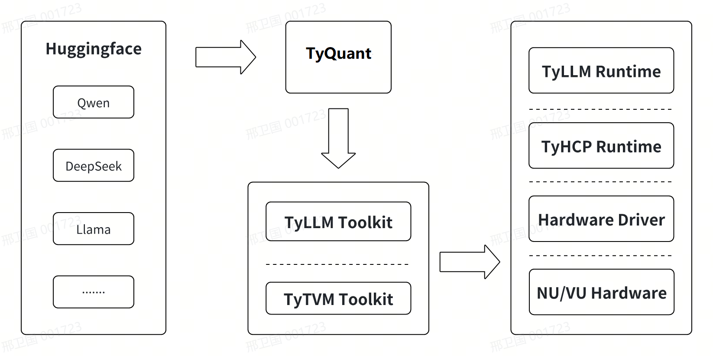

# 更新说明

本文记录了``Edge10``系列大模型工具链的变更情况。
**20260715/v1.2.3**

- 🚀量化工具更新 (v1.1.3)
    - 支持 Qwen3.5 AutoRound敏感层分析和混合精度量化
- 🚀更新量化工具镜像
    - 镜像地址：`113.100.143.90:8091/edgex/tyquantize:v1.1.3`

- 🚀编译工具更新 (v1.2.3)
    - 优化VIT部分精度
    - 优化编译速度，Qwen3.5-2B-3die编译时间从3.5->2小时以内。
- 🚀更新编译工具镜像
    - 镜像地址：`113.100.143.90:8091/edgex/tyllm:v1.2.3`

**20260622/v1.1.2**

- 🚀量化工具更新 (v1.1.2)
    - 新增 Qwen3.5 autoround w4a16量化支持
    - 新增 Qwen3.5 autoround lmhead量化支持
- 🚀更新量化工具镜像
    - 镜像地址：`113.100.143.90:8091/edgex/tyquantize:v1.1.2`
- 🚀更新量化工具使用说明

**20260615/v1.2.2**

- 🚀更新版本v1.2.2
- 🚀编译工具更新(v1.2.2)
    - 支持混合量化编译 Qwen3/Qwen3-VL/Qwen3.5-2B
    - Qwen3.5目前支持 2B/4B (1die/3die)
- 🚀更新编译工具使用说明

**20260513/v1.1.1**

- 🚀量化工具更新 (v1.1.1)
    - 新增 Qwen3.5 模型 GPTQv2 W4A16 量化支持
    - 新增 Qwen3.5 模型敏感层分析工具
    - 新增 Qwen3.5 GPTQv2 W4A16 混合精度量化配置
- 🚀更新量化工具镜像
    - 镜像地址：`113.100.143.90:8091/edgex/tyquantize:v1.1.1`
- 🚀更新量化工具使用说明

**20260327/v1.1.0**

- 🚀量化工具全新版本 (v1.1.0)
    - PETQuant 完成系统性重构，API 全面统一
    - 新增 per block 量化支持（已验证 DeepSeek-R1 模型）
    - 新增性能模式选择，根据显存大小自动适配
    - 重构后顶层 API 更加简洁规范
- 🚀更新量化工具镜像
    - 镜像地址：`113.100.143.90:8091/edgex/tyquantize:v1.1.0`
- 🚀新增支持模型
    - Qwen3-14B、Qwen3-32B
    - MiniCPM-V-4_5、InternVL3-8B
    - Qwen3-Reranker-0.6B
- 🚀更新量化工具使用说明

**202600228/v1.2.1**

- 🚀更新版本v1.2.1
- 🚀编译工具更新(v1.2.1)
    - 修复qwen3-vl-8B精度下降问题
    - 修复一些模型编译出错问题（llama3-8B、qwen1.5-1.8B、qwen2-vl-7B、qwen3-32B 40k）
    - 修复某些图像shape输入下编译崩溃问题
    - 配套hcp版本更新到1.2.21
- 🚀更新大模型支持列表
- 🚀更新编译工具使用说明

**202600115/v1.1.8**

- 🚀更新版本v1.1.8
- 🚀量化工具更新(v1.0.4)
    - 支持AWQ\GPTQv2\Quarot量化方法
- 🚀编译工具更新(v1.1.8)
    - Qwen3 vl 8B vit性能优化
    - 解决Qwen3 vl单Die编译问题
    - vllm升级到0.11.0，解决min max pixel配置问题
    - ubuntu升级到22.04
    - 支持编译Die remap模型
- 🚀更新大模型支持列表
- 🚀更新量化工具使用说明
- 🚀更新编译工具使用说明

**20251128/v1.1.7**

- 🚀正式版本v1.1.7
- 🚀独立的量化工具镜像(v1.0.3)
- 🚀独立的编译工具镜像(v1.1.7)
- 🚀更新大模型支持列表
- 🚀更新量化工具使用说明
- 🚀更新编译工具使用说明

**20250414/v1.0.8**

- 🚀优化``Qwen2.5-VL-7B`` ``ViT``部分性能

**20250320/v1.0.6**

- 🚀新增支持``Qwen2.5-VL-7B``模型``3Die``编译

**20250305/v0.0.2**

- 🚀新增支持``Qwen2.5-VL-7B``模型``4Die/1Die``编译


<br>

# 整体介绍

``TyQuant``为云天励飞大模型量化工具，用户可通过本工具或其它开源量化工具对大模型完成量化；``TyLLM``是云天励飞推出的大模型工具链，可帮助用户将大模型编译为``Edge10``系列芯片上执行的模型。``TyLLM``为云天基于``TyTVM``工具链针对大模型增量开发的工具，主要基于``PyTorch``和``vLLM``对大模型做专属和定制优化；``TyTVM``为云天模型转换、量化、仿真、编译工具链，主要负责将模型编译为芯片执行的模型。

### 整体架构如图：

<div style="text-align:center;">
  
</div>

### 支持模型列表

已经支持的模型如下（包括不限于）：

| Model                                      | Quant Support | Compile Support |
| :----------------------------------------- | :-----------: | :-------------: |
| Qwen/Qwen3.5-2B                            |      ✅       |       ✅        |
| Qwen/Qwen3.5-4B                            |      ✅       |       ✅        |
| Qwen/Qwen3-VL-8B                           |      ✅       |       ✅        |
| Qwen/Qwen3-VL-4B                           |      ✅       |       ✅        |
| Qwen/Qwen3-VL-2B                           |      ✅       |       ✅        |
| Qwen/Qwen3-32B                             |      ✅       |       ✅        |
| Qwen/Qwen3-14B                             |      ✅       |       ✅        |
| Qwen/Qwen3-8B                              |      ✅       |       ✅        |
| Qwen/Qwen3-4B                              |      ✅       |       ✅        |
| Qwen/Qwen3-1.7B                            |      ✅       |       ✅        |
| Qwen/Qwen2.5-VL-7B                         |      ✅       |       ✅        |
| Qwen/Qwen2.5-VL-3B                         |      ✅       |       ✅        |
| Qwen/Qwen2-VL-7B                           |      ❌       |       ✅        |
| Qwen/Qwen2-7B                              |      ✅       |       ✅        |
| Qwen/Qwen1.5-1.8B                          |      ❌       |       ✅        |
| deepseek-ai/DeepSeek-R1-Distill-Qwen-1.5B  |      ✅       |       ✅        |
| deepseek-ai/DeepSeek-R1-Distill-Qwen-7B    |      ✅       |       ✅        |
| deepseek-ai/DeepSeek-R1-Distill-Qwen-32B   |      ✅       |       ✅        |
| Llama3-8B                                  |      ❌       |       ✅        |
| MiniCPM-V-4_5                              |      ✅       |       ❌        |
| InternVL3-8B                               |      ✅       |       ❌        |
| Qwen3-Reranker-0.6B                        |      ✅       |       ❌        |
<br>
<br>

# 一、环境准备

本节介绍使用``TyLLM``工具链前的开发环境准备工作。``TyLLM``使用``Docker``容器进行工具链集成，用户可通过``Docker``加载``TyLLM``镜像文件，然后进行模型量化、编译、评估(未来)等工作，因此开发环境准备阶段需要正确安装``Docker``环境，同时目前需要量化阶段需要``GPU``来加速，以及多模态模型的编译依赖``vLLM``框架来推理，因此暂时需要``GPU``。

- **Nvidia GPU**
- **Nvidia Container Toolkit**
- **Docker>19.03**

### 1.1 安装Nvidia GPU 驱动

```shell
# 驱动版本尽量选择最高（当前量化工具cuda-12.6,驱动建议安装580及以上）
sudo apt install nvidia-driver-530 
# 安装完成后，执行nvidia-smi命令显示如下，表示安装成功。
+-----------------------------------------------------------------------------------------+
| NVIDIA-SMI 580.82.09              Driver Version: 580.82.09      CUDA Version: 13.0     |
+-----------------------------------------+------------------------+----------------------+
| GPU  Name                 Persistence-M | Bus-Id          Disp.A | Volatile Uncorr. ECC |
| Fan  Temp   Perf          Pwr:Usage/Cap |           Memory-Usage | GPU-Util  Compute M. |
|                                         |                        |               MIG M. |
|=========================================+========================+======================|
|   0  NVIDIA GeForce RTX 4090        Off |   00000000:67:00.0 Off |                  Off |
| 56%   49C    P0             68W /  450W |       3MiB /  24564MiB |      0%      Default |
|                                         |                        |                  N/A |
+-----------------------------------------+------------------------+----------------------+
                                                                                         
+---------------------------------------------------------------------------------------+
| Processes:                                                                            |
|  GPU   GI   CI        PID   Type   Process name                            GPU Memory |
|        ID   ID                                                             Usage      |
|=======================================================================================|
|  No running processes found                                                           |
+---------------------------------------------------------------------------------------+
```

### 1.2 安装Docker

```shell
sudo apt install docker.io
sudo docker -v
```

### 1.3 安装Nvidia Container Toolkit

添加包仓库和``GPG key``:
```shell
distribution=$(. /etc/os-release;echo $ID$VERSION_ID) \
    && curl -fsSL https://nvidia.github.io/libnvidia-container/gpgkey | sudo gpg --dearmor -o /usr/share/keyrings/nvidia-container-toolkit-keyring.gpg \
    && curl -s -L https://nvidia.github.io/libnvidia-container/$distribution/libnvidia-container.list | \
             sed 's#deb https://#deb [signed-by=/usr/share/keyrings/nvidia-container-toolkit-keyring.gpg] https://#g' | \
             sudo tee /etc/apt/sources.list.d/nvidia-container-toolkit.list
```

更新源，安装nvidia-container-toolkit

```shell
sudo apt update
sudo apt install nvidia-container-toolkit
```

### 1.4 安装TyQuant量化工具

量化工具镜像获取途径如下，请务必将``${version}``替换为实际对应的版本号，比如``v1.1.2``：

```shell
sudo docker login 113.100.143.90:8091 -u custom -p DE@sz_intellif_2021
sudo docker pull 113.100.143.90:8091/edgex/tyquantize:${version}
```


### 1.5 安装TyLLM工具链

编译工具链获取途径如下，请务必将``${version}``替换为实际对应的工具链版本号，比如``v1.2.2``：

```shell
sudo docker login 113.100.143.90:8091 -u custom -p DE@sz_intellif_2021
sudo docker pull 113.100.143.90:8091/edgex/tyllm:${version}
```

> **注意**
> 
> 需要将``113.100.143.90:8091``加入``/etc/docker/daemon.json``中的``insecure-registries``字段中，如下：
> 
> ```json
> {     
>      "insecure-registries": ["113.100.143.90:8091"]
> }
>  ```
> 修改后，重启``docker``生效，``sudo systemctl restart docker``

---
<br>
<br>

# 二、模型量化

必须在带有GPU的主机量化以加快速度。

## 2.1 启动量化工具镜像

以下命令创建容器，其中``${your_data_dir}``表示宿主机中用户数据目录，``${version}``需改为实际版本``tag``。
```shell
sudo docker run --gpus all -v ${your_data_dir}:/data -it 113.100.143.90:8091/edgex/tyquantize:${version} bash
```
> 注意：v1.1.2 镜像内完整量化样例位于 `/opt/app/test`，配置文件位于 `/opt/app/configs`，敏感层分析工具位于 `/opt/app/tools/llm_sensitivity_analysis`。

### 2.1.1 v1.1.2 目录结构

- `/opt/app/test`
  - `test.py`：拆分式入口，分别传入 `quant_config`、`alg_config`、`dataset_config`、`sampling_config`
  - `test_unified_config.py`：推荐入口，使用单个 `unified_config` 同时描述量化配置和算法配置
  - 其余 `test_*.py`：各模型/算法的独立示例
- `/opt/app/configs/alg_configs`
  - 算法配置，当前镜像包含 `awq.json`、`empty.json`、`gptqv2.json`、`gptqv2_vlm.json`、`ostquant.json`、`quarot.json`、`rtn.json`、`smoothquant.json`
- `/opt/app/configs/quant_configs`
  - 模型量化配置，例如 `Qwen3_wui4_g.json`、`Qwen3_wi4_c_ai8_k_mse.json`、`Qwen3_VL_wi8_c_ai8_t.json`
- `/opt/app/configs/dataset_configs`
  - 校准/评测数据配置，命名规则为 `算法_模型_calib.json` 或 `算法_模型_eval.json`
- `/opt/app/configs/unified_configs`
  - 推荐使用的一体化配置，例如 `autoround_qwen3_5_w4a16_per_group_default.json`、`autoround_qwen3_5_w4a16_per_group_lm_head.json`、`autoround_qwen3_5_w4a16_per_group_lm_head_tie_embed.json`、`awq_qwen3.json`、`gptqv2_qwen3.json`、`ostquant_qwen3.json`
- `/opt/app/configs/sampling_configs`
  - 推理验证默认参数，当前镜像包含 `llm_default.json`、`vlm_default.json`、`reranker_default.json`
- `/opt/app/tools/llm_sensitivity_analysis`
  - LLM 敏感层分析工具，包含 `run_llm_sensitivity.py` 和 `analysis_configs/*`

### 2.1.2 推荐使用方式

v1.1.2 的量化入口已经统一，建议优先使用 `test/test_unified_config.py`。流程如下：

1. 从 `configs/unified_configs/*.json` 读取 `quant_config` 和 `alg_config`
2. 根据 `model_path` 与 `dataset_path` 自动创建 `DataSelector`
3. 调用 `PETQuantizer.run(...)` 执行量化
4. 调用 `save_model(...)` 保存量化模型
5. 调用 `generate(...)` 或 `load_model(...)` 做回归验证

如需分别切换量化配置、算法配置、采样配置，可改用 `test/test.py`。

#### VLM / Qwen3.5 回归验证图片准备

`test/test_unified_config.py` 在保存模型后会根据模型 `config.json` 自动选择回归验证方式：

- 普通 LLM：使用默认文本 prompt 调用 `generate(...)`
- VLM 或包含 `vision_config` 的模型：使用默认图片调用 `generate(...)`

`v1.1.2` 原生镜像中的默认 VLM 图片路径为：

```text
/nfs/AIED/qiujingkai/git_proj/quant_toolchain/logs/demo.jpeg
```

客户环境通常没有该 `/nfs/...` 路径。若该图片不存在，量化模型可能已经保存成功，但后置 smoke test 会在图片解析阶段报错，例如 `Incorrect image source` 或 `Invalid base64-encoded string`。因此运行 Qwen3-VL、Qwen2.5-VL、Qwen3.5 等包含视觉配置的模型前，建议先在容器内准备一张可访问的测试图片：

```bash
mkdir -p /nfs/AIED/qiujingkai/git_proj/quant_toolchain/logs
cp /data/demo.jpeg /nfs/AIED/qiujingkai/git_proj/quant_toolchain/logs/demo.jpeg
```

其中 `/data/demo.jpeg` 可替换为用户挂载进容器的任意 JPEG 图片。离线交付时建议随交付包提供一张 `demo.jpeg`，或在交付镜像中内置该文件。

如果日志中已经出现 `量化模型成功` 和 `保存量化模型成功`，但随后仅在上述默认图片路径处报错，表示量化产物已保存；该错误只影响后置生成验证，不影响已保存模型文件。

### 2.1.3 新版 API 使用指南

PETQuant 完成系统性重构后采用统一的顶层 API，支持通过 JSON 配置文件管理所有量化参数。

**核心类说明：**

| 类名 | 说明 |
|------|------|
| `ConfigHelper` | 量化配置类，包含权重量化和激活值量化配置 |
| `AlgConfig` | 量化算法配置类，支持 AWQ、GPTQv2、OSTQuant、Quarot 等算法 |
| `PETQuantizer` | 量化器核心类，执行量化、保存、加载、推理等操作 |
| `DataSelector` | 数据集选择器，根据模型和算法自动匹配校准数据 |

**基本使用流程：**

```python
from pathlib import Path
from PETQuant import ConfigHelper, AlgConfig, PETQuantizer, DataSelector, PerformanceModeEnum

# 1. 从文件获取量化配置和算法配置
quant_configs = [ConfigHelper.create_from_file(Path(quant_config_file))]
alg_configs = [AlgConfig.create_from_file(Path(alg_config_file))]

# 2. 创建 PETQuantizer 对象
mode = PerformanceModeEnum.Auto  # 根据显存自动选择性能模式
pet_quantizer = PETQuantizer(
    model_path=args.model_path,
    alg_configs=alg_configs,
    quant_configs=quant_configs,
    mode=mode,
)

# 3. 创建数据集选择器
data_selector = DataSelector.from_model(
    pet_quantizer.get_model(), args.dataset_path
)

# 4. 获取模型名称和算法名称
model_name = pet_quantizer.get_model_name()
alg_names = pet_quantizer.get_alg_names()

# 5. 从文件读取校准数据集配置参数
calib_dataset_params = dict_from_json_file(Path(args.calib_dataset_config_file))

# 6. 选择 dataloader
calib_dataloader = data_selector.get_dataloader(
    model_name, alg_names[0], **calib_dataset_params
)

# 7. 执行量化
pet_quantizer.run(dataloader=calib_dataloader)
print("量化成功")

# 8. 保存量化模型
pet_quantizer.save_model(save_path=args.save_path)

# 9. 验证量化模型
sampling_params = {
    "prompt": "什么是量子力学？",
    "enable_thinking": False,
    "sampling_params": {
        "max_new_tokens": 100,
        "do_sample": False,
    },
}
print(pet_quantizer.generate(**sampling_params))
```

**示例代码路径：** `PETQuant/test/test.py` 或 `PETQuant/test/test_unified_config.py`

**配置文件路径：** `PETQuant/configs/`

## 2.2 量化模型指标评估专属环境（w4a8 / lm_head 量化必用）
官方 vLLM 不支持 W4A8 量化模型；AutoRound lm_head 量化模型也需使用已适配的定制 vLLM 环境。创建容器如下：
镜像地址：`192.168.14.129:80/library/aied/custom-vllm:0.11.0`
创建容器命令：
```bash
docker run -it --name vllm_custom --gpus all -v  /data/:/data/ --ipc host  -p 8001:8000 --shm-size 16g 192.168.14.129:80/library/aied/custom-vllm:0.11.0 bash
```

**版本适配说明：**

- 当前 `tyquantize:v1.1.2` 量化镜像内 `transformers` 已升级到 `5.8.0`。
- Qwen3.5 混合量化产物依赖更新的 vLLM / transformers 支持，不能使用 `192.168.14.129:80/library/aied/custom-vllm:0.11.0` 进行部署或冒烟测试。请使用已适配 Qwen3.5 架构的新版 vLLM 环境。
- Qwen3.5 AutoRound quant_lm_head 会量化 `lm_head`，部署时同样需要使用定制 vLLM；启动命令设置 `--dtype half`，不要手动添加 `--quantization awq`。
- `192.168.14.129:80/library/aied/custom-vllm:0.11.0` 仅用于当前文档中的 W4A8 量化模型及已验证兼容的 Qwen3 量化 / 混合量化模型测试。


## 2.3 支持的量化算法
v1.1.2 版本支持以下量化算法，以下内容依据镜像内 `/opt/app/test`、`/opt/app/configs` 与 `/opt/app/tools` 实际文件整理：


| 量化算法 | 支持精度 | 权重量化 | 激活值量化 | 激活值动态量化 | 推荐硬件配置 |
|----------|----------|----------|------------|----------------|--------------|
| AutoRound | Wi4Af16 | 支持 int4 | 不量化 | 否 | Qwen3.5-2B/4B 已有样例 |
| AWQ | Wi4Af16 | 非对称 | 不量化 | 否 | Qwen3-8B/14B: A800/4090*1; Qwen3-32B: A800/4090*1 |
| GPTQv2 | Wi4Ai8、Wi8Ai8、Wi4Af16 | 非对称 | 非对称 | 支持 int8 动态/静态 | 4090*1（Qwen3 / Qwen3-VL / Qwen2.5-VL / Qwen3.5 已有样例） |
| OSTQuant | Ai8 动态激活量化 | 不量化 | 对称 | 是 | 需使用 `torchrun` 分布式启动，卡数按模型规模选择 |
| Quarot | Wi4Ai8、Wi8Ai8 | 对称 | 对称 | 是 | Qwen3: 4090*1；DeepSeek-R1: 建议 8xA800，CPU 内存至少 1000G |
| SmoothQuant | Wi8Ai8 | 对称 | 对称 | 是 | Qwen3-32B: 4090*1 |
| RTN | Wi8Ai8、Wi4Af16、NVFP4 | 取决于配置 | 取决于配置 | 支持 | Qwen3 / Qwen3-VL / ViT 已有样例 |

**注意：**
- 所有量化算法均不支持 Attention 层量化
- `ostquant` 仍按“两阶段”顺序执行：先进行 OSTQuant 训练，再进行 GPTQv2 实量化
- 对于 VLM，多子模块量化场景通常需要传入多份 `quant_config` / `alg_config`，或直接使用对应的 `unified_config`
- Qwen3.5 AutoRound 支持三类配置：default 不量化 `lm_head`；quant_lm_head_without_tie_embed 量化 `lm_head`，用于 `tie_word_embeddings=false` 场景。quant_lm_head_with_tie_embed 量化 `lm_head`，用于 `tie_word_embeddings=true` 场景
- Qwen3.5 的 GPTQv2 W4A16 配置默认只量化 LLM 子模块，`submodel_0` 保持不量化；`fallback` 会跳过 `lm_head`、`mtp.*` 和 `linear_attn.*`

---

## 2.4 量化示例
### 2.4.1 推荐命令入口：`test/test_unified_config.py`

推荐直接使用统一配置文件。其优势是一个 JSON 同时描述 `quant_config`、`alg_config` 和默认 `calib_dataset_params`，更适合文档化和批量复现。

```bash
cd /opt/app
python3 test/test_unified_config.py \
  --unified-config-file configs/unified_configs/awq_qwen3.json \
  --model-path /data/models/Qwen3-0.6B \
  --dataset-path /data/datasets/cnn_dailymail \
  --save-path /data/quant_models/Qwen3-0.6B-awq \
  --mode Auto
```

### 2.4.2 可选命令入口：`test/test.py`

如需分别切换量化配置、算法配置、采样配置，可使用拆分式入口：

```bash
cd /opt/app
python3 test/test.py \
  --quant-config-file configs/quant_configs/Qwen3_wui4_g.json \
  --alg-config-file configs/alg_configs/awq.json \
  --model-path /data/models/Qwen3-0.6B \
  --dataset-path /data/datasets/cnn_dailymail \
  --calib-dataset-config-file configs/dataset_configs/awq_qwen3_calib.json \
  --save-path /data/quant_models/Qwen3-0.6B-awq \
  --mode Auto \
  --sampling-params-file configs/sampling_configs/llm_default.json
```

### 2.4.3 镜像内已提供的统一配置样例

| 算法 | 统一配置文件 | 说明 |
|------|--------------|------|
| AutoRound | `autoround_qwen3_5_w4a16_per_group_default.json` | Qwen3.5，LLM W4A16，不量化 lm_head |
| AutoRound | `autoround_qwen3_5_w4a16_per_group_lm_head.json` | Qwen3.5，LLM W4A16，量化 lm_head，`tie_word_embeddings=false` |
| AutoRound | `autoround_qwen3_5_w4a16_per_group_lm_head_tie_embed.json` | Qwen3.5，LLM W4A16，量化 lm_head，`tie_word_embeddings=true` |
| AWQ | `awq_qwen3.json` | Qwen3 LLM |
| AWQ | `awq_qwen3_vl.json` | Qwen3-VL，多子模块 |
| AWQ | `awq_qwen2_5.json` | Qwen2.5 LLM |
| AWQ | `awq_qwen2_5_vl.json` | Qwen2.5-VL |
| AWQ | `awq_intern_vl.json` | InternVL |
| AWQ | `awq_minicpm_v.json` | MiniCPM-V |
| AWQ | `awq_qwen3_reranker.json` | Qwen3-Reranker |
| AWQ | `awq_qwen3_5.json` | Qwen3.5 |
| GPTQv2 | `gptqv2_qwen3.json` | Qwen3，Wi4Ai8 |
| GPTQv2 | `gptqv2_qwen3_vl.json` | Qwen3-VL，视觉 W8A8 + LLM W4A8 |
| GPTQv2 | `gptqv2_qwen2_5_vl.json` | Qwen2.5-VL，视觉 W8A8 + LLM W4A8 |
| GPTQv2 | `gptqv2_per_channel_w4a16_qwen3.json` | Qwen3，Wi4Af16 |
| GPTQv2 | `gptqv2_per_group_w4a16_int4_qwen3.json` | Qwen3，per-group W4A16 |
| GPTQv2 | `gptqv2_qwen3_5_w4a16.json` | Qwen3.5，LLM W4A16 |
| GPTQv2 | `gptqv2_qwen3_5_w4a16_mix.json` | Qwen3.5，LLM W4A16 混合精度 |
| OSTQuant | `ostquant_qwen3.json` | Qwen3，先 OSTQuant 训练，再 GPTQv2 实量化 |
| Quarot | `quarot_qwen3.json` | Qwen3，Wi4Ai8 |
| Quarot | `quarot_deepseek_v3.json` | DeepSeek-R1，Wi4Ai8 |
| RTN | `rtn_per_block_per_group_qwen3.json` | Qwen3，per-block/per-group |
| RTN | `rtn_qwen3_nvfp4.json` | Qwen3，NVFP4 |
| RTN | `rtn_vit.json` | ViT |
| SmoothQuant | `smooth_qwen3.json` | Qwen3，Wi8Ai8 |

### 2.4.4 常用量化命令

#### AWQ：Qwen3

```bash
cd /opt/app
python3 test/test_unified_config.py \
  --unified-config-file configs/unified_configs/awq_qwen3.json \
  --model-path /data/models/Qwen3-0.6B \
  --dataset-path /data/datasets/cnn_dailymail \
  --save-path /data/quant_models/Qwen3-0.6B-awq \
  --mode Auto
```

#### AWQ：Qwen3-VL

```bash
cd /opt/app
python3 test/test_unified_config.py \
  --unified-config-file configs/unified_configs/awq_qwen3_vl.json \
  --model-path /data/models/Qwen3-VL-2B-Instruct \
  --dataset-path /data/datasets/flickr30k_test512 \
  --save-path /data/quant_models/Qwen3-VL-2B-Instruct-awq \
  --mode Auto
```

#### GPTQv2：Qwen3

```bash
cd /opt/app
python3 test/test_unified_config.py \
  --unified-config-file configs/unified_configs/gptqv2_qwen3.json \
  --model-path /data/models/Qwen3-0.6B \
  --dataset-path /data/datasets/wikitext2 \
  --save-path /data/quant_models/Qwen3-0.6B-gptqv2 \
  --mode High
```

#### GPTQv2：Qwen3.5 W4A16

```bash
cd /opt/app
python3 test/test_unified_config.py \
  --unified-config-file configs/unified_configs/gptqv2_qwen3_5_w4a16.json \
  --model-path /data/models/Qwen3.5-2B \
  --dataset-path /data/datasets/HuggingFaceH4/ultrachat_200k \
  --save-path /data/quant_models/Qwen3.5-2B-gptqv2-w4a16 \
  --mode High \
  --torch-dtype bfloat16
```

#### GPTQv2：Qwen3.5 W4A16 混合精度

```bash
cd /opt/app
python3 test/test_unified_config.py \
  --unified-config-file configs/unified_configs/gptqv2_qwen3_5_w4a16_mix.json \
  --model-path /data/models/Qwen3.5-2B \
  --dataset-path /data/datasets/HuggingFaceH4/ultrachat_200k \
  --save-path /data/quant_models/Qwen3.5-2B-gptqv2-w4a16-mix \
  --mode High \
  --torch-dtype bfloat16
```

> Qwen3.5 W4A16 / W4A16 混合精度量化建议显式指定 `--torch-dtype bfloat16`。若模型配置包含 `vision_config`，请先按“VLM / Qwen3.5 回归验证图片准备”放置默认 smoke test 图片。

#### AutoRound：Qwen3.5 W4A16，default: 不量化 lm_head

AutoRound 使用 `NeelNanda_pile-10k` 作为校准数据集。量化过程中可能出现 `Deterministic behavior` 相关 `UserWarning`，不影响量化；如需规避，可在命令前增加 `CUBLAS_WORKSPACE_CONFIG=:4096:8`。

```bash
cd /opt/app
CUDA_VISIBLE_DEVICES=0 TOKENIZERS_PARALLELISM=false python3 test/test_unified_config.py \
  --unified-config-file configs/unified_configs/autoround_qwen3_5_w4a16_per_group_default.json \
  --model-path /data/models/Qwen3.5-2B \
  --dataset-path /data/datasets/NeelNanda_pile-10k \
  --save-path /data/quant_models/Qwen3.5-2B-AutoRound-default
```

#### AutoRound：Qwen3.5 W4A16，quant_lm_head_without_tie_embed: 量化 lm_head，`tie_word_embeddings=false`

```bash
cd /opt/app
CUDA_VISIBLE_DEVICES=0 TOKENIZERS_PARALLELISM=false python3 test/test_unified_config.py \
  --unified-config-file configs/unified_configs/autoround_qwen3_5_w4a16_per_group_lm_head.json \
  --model-path /data/models/Qwen3.5-2B \
  --dataset-path /data/datasets/NeelNanda_pile-10k \
  --save-path /data/quant_models/Qwen3.5-2B-AutoRound-lm_head
```

#### AutoRound：Qwen3.5 W4A16，quant_lm_head_with_tie_embed: 量化 lm_head，`tie_word_embeddings=true`

```bash
cd /opt/app
CUDA_VISIBLE_DEVICES=0 TOKENIZERS_PARALLELISM=false python3 test/test_unified_config.py \
  --unified-config-file configs/unified_configs/autoround_qwen3_5_w4a16_per_group_lm_head_tie_embed.json \
  --model-path /data/models/Qwen3.5-2B \
  --dataset-path /data/datasets/NeelNanda_pile-10k \
  --save-path /data/quant_models/Qwen3.5-2B-AutoRound-lm_head_tie_embed
```

> AutoRound quant_lm_head 量化了 `lm_head`，部署时需要使用定制 vLLM 镜像；启动命令设置 `--dtype half`，不要手动添加 `--quantization awq`。

#### GPTQv2：Qwen3-VL（视觉 W8A8 + LLM W4A8）

```bash
cd /opt/app
python3 test/test_unified_config.py \
  --unified-config-file configs/unified_configs/gptqv2_qwen3_vl.json \
  --model-path /data/models/Qwen3-VL-8B-Instruct \
  --dataset-path /data/datasets/flickr30k_test512 \
  --save-path /data/quant_models/Qwen3-VL-8B-gptqv2 \
  --mode Auto
```

#### OSTQuant：Qwen3

`ostquant` 仍按两阶段顺序执行：先进行 OSTQuant 训练，再进行 GPTQv2 实量化。运行时 `DataSelector` 会返回 `train/eval` 两路 dataloader。镜像自带样例如下：

```bash
cd /opt/app
torchrun --nnodes 1 --nproc_per_node 4 test/test_unified_config.py \
  --unified-config-file configs/unified_configs/ostquant_qwen3.json \
  --model-path /data/models/Qwen3-0.6B \
  --dataset-path /data/datasets/Salesforce_wikitext \
  --save-path /data/quant_models/Qwen3-0.6B-ostquant \
  --mode Auto
```

#### Quarot：DeepSeek-R1

```bash
cd /opt/app
python3 test/test_unified_config.py \
  --unified-config-file configs/unified_configs/quarot_deepseek_v3.json \
  --model-path /data/models/DeepSeek-R1-BF16 \
  --dataset-path "" \
  --save-path /data/quant_models/DeepSeek-R1-quarot \
  --mode Auto
```

> DeepSeek-R1 模型较大，建议使用 8xA800，CPU 内存至少 1000G。

#### SmoothQuant：Qwen3

```bash
cd /opt/app
python3 test/test_unified_config.py \
  --unified-config-file configs/unified_configs/smooth_qwen3.json \
  --model-path /data/models/Qwen3-32B \
  --dataset-path /data/datasets/pile-val \
  --save-path /data/quant_models/Qwen3-32B-smooth \
  --mode Auto
```

#### RTN：Qwen3 NVFP4

```bash
cd /opt/app
python3 test/test_unified_config.py \
  --unified-config-file configs/unified_configs/rtn_qwen3_nvfp4.json \
  --model-path /data/models/Qwen3-4B \
  --dataset-path /data/datasets/ultrachat_200k \
  --save-path /data/quant_models/Qwen3-4B-rtn-nvfp4 \
  --mode Auto
```

#### RTN：ViT

```bash
cd /opt/app
python3 test/test_unified_config.py \
  --unified-config-file configs/unified_configs/rtn_vit.json \
  --model-path /data/models/vit-base-patch16-224 \
  --dataset-path /data/datasets/quant_data \
  --eval-dataset-config-file configs/dataset_configs/rtn_vit_eval.json \
  --save-path /data/quant_models/vit-base-patch16-224-rtn \
  --mode Auto
```

### 2.4.5 配置文件说明

#### `quant_configs`

文件命名规则为：

```text
<模型架构枚举值>[_w<dtype缩写>_<granularity缩写>][_a<dtype缩写>_<granularity缩写>].json
```

常见示例：

- `Qwen3_wui4_g.json`：Qwen3，权重 `uint4/per_group`，用于 AWQ
- `Qwen3_wi4_c_ai8_k_mse.json`：Qwen3，权重 `int4/per_channel` + 激活 `int8/per_token`，用于 GPTQv2
- `Qwen3_ai8_k.json`：Qwen3，仅激活 `int8/per_token`，用于 OSTQuant
- `Qwen3_wnvfp4_g_anvfp4_g.json`：Qwen3，权重和激活均为 `nvfp4/per_group`
- `Qwen3_VL_wi8_c_ai8_t.json` + `Qwen3_VL_wi4_c_ai8_k.json`：Qwen3-VL 多子模块配置

完整命名规则见 `/opt/app/configs/quant_configs/name.md`。

#### `dataset_configs`

当前镜像中大部分 `*_calib.json` 内容为 `{}`，表示使用 `DataSelector` 的默认参数匹配逻辑；文档中仍建议保留对应文件路径，便于后续按算法或模型扩展。ViT 额外使用 `rtn_vit_eval.json` 作为评测集配置。

#### 数据集目录格式要求

当前镜像并不是所有量化算法都要求 `datasets.save_to_disk()` 生成的 HuggingFace Dataset 目录。`dataset_path` 的格式由镜像内 `PETQuant.data.loader.DataSelector` 根据模型类型和算法选择，建议优先按本文档示例和镜像内配置使用对应数据集格式。

常见格式如下：

| 场景 | 镜像内读取方式 | `dataset_path` 要求 |
|------|----------------|---------------------|
| Qwen3 GPTQv2 / SmoothQuant，以及自定义文本校准集用于 GPTQv2 混合量化 | `load_from_disk(dataset_path)` | HuggingFace Dataset 本地目录，通常包含 `data-*.arrow`、`dataset_info.json`、`state.json` |
| Qwen3-VL / Qwen2.5-VL 的 AWQ、GPTQv2、SmoothQuant | `load_from_disk(dataset_path)` | HuggingFace Dataset 本地目录，多模态字段需与镜像内 VLM dataloader 期望一致 |
| Qwen3 AWQ | `load_dataset(dataset_path, name="3.0.0", split="train")` | 可被 `datasets.load_dataset` 读取的数据集目录或数据集名称，例如 `cnn_dailymail` |
| Qwen3.5 AWQ / GPTQv2 | `load_dataset(dataset_path, split="train_sft[:num_samples]")` | 可被 `datasets.load_dataset` 读取的对话数据集目录或缓存快照，例如 `HuggingFaceH4/ultrachat_200k`，样本需包含 `messages` 字段 |
| OSTQuant Qwen3 | `load_dataset(dataset_path, "wikitext-2-raw-v1", split=...)` | Wikitext 格式数据集目录，例如 `Salesforce_wikitext`；不要传 `load_from_disk` 产物目录 |
| Quarot | 不读取校准集 | `dataset_path` 可为空字符串 |
| ViT RTN | 镜像内 ViT dataloader 直接读取图片数据目录 | 按 `rtn_vit_calib.json` / `rtn_vit_eval.json` 对应目录组织 |

如果手头是普通 JSON 校准集，且目标算法走 `load_from_disk`，需要先转换为 HuggingFace Dataset 本地目录。例如文本校准集可整理为 `text` 列：

```python
from datasets import Dataset
import json

src = "/data/datasets/Calibration.json"
out = "/data/datasets/calibration_hf"

with open(src, encoding="utf-8") as f:
    data = json.load(f)

texts = [item["text"] for item in data if item.get("text")]
Dataset.from_dict({"text": texts}).save_to_disk(out)
```

转换后在量化命令中使用：

```bash
--dataset-path /data/datasets/calibration_hf
```

或在敏感层分析中使用：

```bash
--calibration-dataset-path /data/datasets/calibration_hf
```

注意：`calib_dataset_params` 中的 `column`、`num_samples`、`max_seq_len`、`chat_template` 等参数必须与实际数据字段匹配。若使用镜像默认配置，大部分 `*_calib.json` 为空，会走各算法 dataloader 的默认字段约定。

#### `sampling_configs`

- `llm_default.json`：LLM 文本生成验证
- `vlm_default.json`：VLM 图文生成验证
- `reranker_default.json`：Reranker 相关性验证

### 2.4.6 Qwen3.5 敏感层分析

`v1.1.1` 镜像新增 LLM 敏感层分析工具，可用于生成混合精度量化所需的敏感层排序。

脚本路径：

```text
/opt/app/tools/llm_sensitivity_analysis/run_llm_sensitivity.py
```

示例命令：

```bash
cd /opt/app
python3 tools/llm_sensitivity_analysis/run_llm_sensitivity.py \
  --model-path /data/models/Qwen3.5-2B \
  --calibration-dataset-path /data/datasets/HuggingFaceH4/ultrachat_200k \
  --unified-config-file tools/llm_sensitivity_analysis/analysis_configs/gptqv2_llm_qwen3_5.json \
  --output-dir /data/analysis_results/Qwen3.5-2B-gptqv2 \
  --mode High
```

输出目录的 `results/` 下会保存敏感层分析结果：

- `topk.txt`：各层敏感度排序及 MAE 值
- `mae_by_layer.png`：各层敏感度趋势图

混合精度量化可参考：

```text
configs/unified_configs/gptqv2_qwen3_5_w4a16_mix.json
```

其中 `fallback` 字段用于指定不量化的层（一般取topk的前6层配置为跳过量化），例如：

```json
"fallback": [
  "lm_head",
  "mtp.*",
  "model.language_model.layers.*.linear_attn.*",
  "model.language_model.layers.(0|2|3|4|5|7)(\\..*)?$"
]
```

#### Qwen3.5 敏感层分析常见问题

**现象：** Qwen3.5 敏感层分析运行到部分 layer 后报错，日志中出现类似：

```text
RuntimeError: Expected all tensors to be on the same device, but found at least two devices, cuda:0 and cpu
```

**原因：** 敏感层分析会逐层替换/量化模型并抽取特征。Qwen3.5 模型在显存不足或自动显存调度触发 CPU offload 时，部分模块可能被 `accelerate` 放到 CPU，后续逐层计算时会出现 CPU / GPU 张量混用。

**处理建议：**

1. 优先使用显存更大的单卡运行，避免模型被自动 offload 到 CPU。
2. 运行前确认目标 GPU 上没有其他大模型进程，必要时降低并发任务数量。
3. 校准集先使用较小子集验证流程，确认可以完整生成 `results/topk.txt`、`results/ranking.json` 后再扩大样本数。
4. 若仍复现该错误，表示当前 `v1.1.2` 原生镜像在该模型/显存组合下无法稳定完成敏感层分析；可先使用已有敏感层列表进行混合量化，或联系工具维护方获取修复后的镜像版本。

## 2.5 指标评估


### 2.5.1 量化模型指标评估
#### 步骤1：进入vllm定制容器，启动vllm服务
```bash
# 进入容器
docker exec -it vllm_custom bash
# 指定GPU
export CUDA_VISIBLE_DEVICES=4,5,6,7 
# 启动vllm openai接口服务
python3 -m vllm.entrypoints.openai.api_server --model /data/llmodels/Qwen3-32B_ostquant_gptqv2_1 --tensor-parallel-size 4 --served-model-name qwen3-32b --trust-remote-code  --dtype float16 --max-model-len 8192 --gpu-memory-utilization 0.5 --max-num-seqs 16   --quantization awq_triton_w4a8 --port 8000
```

**特别说明：`--quantization` 需要按量化产物类型选择，不能直接套用上面的示例值。**

上面命令中的 `--quantization awq_triton_w4a8` 仅适用于 W4A8 类量化模型示例。若量化产物是 GPTQv2 W4A16 或 W4A16 混合精度模型，应使用定制 vLLM 支持的 W4A16 加载方式，例如：

```bash
python3 -m vllm.entrypoints.openai.api_server \
  --model /data/quant_models/Qwen3-4B-GPTQv2-W4A16-Mix \
  --served-model-name qwen3-w4a16-mix \
  --trust-remote-code \
  --dtype float16 \
  --max-model-len 8192 \
  --gpu-memory-utilization 0.5 \
  --max-num-seqs 16 \
  --quantization awq \
  --port 8000
```

常见选择：

- GPTQv2 W4A16 / W4A16 混合精度量化模型：优先使用 `--quantization awq`，不要使用 `awq_triton_w4a8`。
- AutoRound default（不量化 `lm_head`）：按目标 vLLM 环境的 AutoRound 支持方式部署。
- AutoRound quant_lm_head（量化 `lm_head`）：使用定制 vLLM，设置 `--dtype half`，不要手动添加 `--quantization awq`。
- W4A8 量化模型：使用定制 vLLM，并按模型适配情况选择 `--quantization awq_triton_w4a8`。
- 若模型 `config.json` 已包含可被 vLLM 自动识别的 `quantization_config`，仍建议按上面的产物类型显式选择部署参数，避免不同 vLLM 版本自动识别行为不一致。
- `--tensor-parallel-size` 按模型规模和 GPU 数设置；小模型冒烟测试通常单卡即可，不需要照抄 32B 示例中的 `--tensor-parallel-size 4`。

**Qwen3 / Qwen3.5 兼容性说明：**

- 当前 `tyquantize:v1.1.2` 量化镜像内 `transformers` 已升级到 `5.8.0`。Qwen3.5 混合量化模型和 AutoRound lm_head 量化模型必须部署在已适配 Qwen3.5 架构的新版 vLLM 环境中，不适用于 `192.168.14.129:80/library/aied/custom-vllm:0.11.0`。
- 若使用当前量化镜像对 Qwen3 做了量化或混合量化，并希望在 `192.168.14.129:80/library/aied/custom-vllm:0.11.0` 中冒烟测试，需要先处理量化模型目录下的 tokenizer 文件，否则可能在加载 tokenizer 时失败。
- 方法一：手动编辑量化模型目录下的 `tokenizer_config.json`，将字段 `extra_special_tokens` 改为 `additional_special_tokens`。
- 方法二：直接从原始模型目录复制 `tokenizer.json` 和 `tokenizer_config.json` 到量化模型目录，覆盖量化产物中的同名文件。

#### 步骤2：容器外执行评估框架（evalscope）
```python
from evalscope import TaskConfig, run_task

task_cfg = TaskConfig(
    model='qwen3-32b',
    api_url='http://127.0.0.1:8001/v1/chat/completions',
    eval_type='openai_api',
    datasets=['mmlu'],    
    eval_batch_size=32,
    generation_config={
        'max_tokens': 8192,  # 最大生成token数，建议设置为较大值避免输出截断
        'temperature': 0.7,  # 采样温度 (qwen 报告推荐值)
        'top_p': 0.8,  # top-p采样 (qwen 报告推荐值)
        'top_k': 20,  # top-k采样 (qwen 报告推荐值)
        'n': 1,  # 每个请求产生的回复数量
        'extra_body':{'chat_template_kwargs': {'enable_thinking': False}}  # 关闭思考模式
    },
    timeout=60000,  # 超时时间
    stream=True,  # 是否使用流式输出
    # limit=1000,  # 设置为1000条数据进行测试
)

run_task(task_cfg=task_cfg)
```

---

## 2.6、编译前置注意事项
### 2.6.1 编译前置说明
- ✅ w4a8 模型：**必须修改config.json配置文件** 后才能编译，是核心前置步骤

### 2.6.2 w4a8 模型 config.json 配置修改
打开量化模型目录下的 `Qwen3-32B_ostquant_gptqv2_1/config.json`，替换为以下完整内容：
```json
{
    "architectures": [
        "Qwen3ForCausalLM"
    ],
    "attention_bias": false,
    "attention_dropout": 0.0,
    "bos_token_id": 151643,
    "eos_token_id": 151645,
    "head_dim": 128,
    "hidden_act": "silu",
    "hidden_size": 5120,
    "initializer_range": 0.02,
    "intermediate_size": 25600,
    "max_position_embeddings": 40960,
    "max_window_layers": 64,
    "model_type": "qwen3",
    "num_attention_heads": 64,
    "num_hidden_layers": 64,
    "num_key_value_heads": 8,
    "rms_norm_eps": 1e-06,
    "rope_scaling": null,
    "rope_theta": 1000000,
    "sliding_window": null,
    "tie_word_embeddings": false,
    "torch_dtype": "bfloat16",
    "transformers_version": "4.51.3",
    "use_cache": false,
    "use_sliding_window": false,
    "vocab_size": 151936,
    "quantization_config": {
        "config_groups": {
            "group_0": {
                "input_activations": {
                    "actorder": null,
                    "block_structure": null,
                    "dynamic": true,
                    "group_size": null,
                    "num_bits": 8,
                    "observer": null,
                    "observer_kwargs": {},
                    "strategy": "token",
                    "symmetric": true,
                    "type": "int"
                },
                "output_activations": null,
                "targets": [
                    "Linear"
                ],
                "weights": {
                    "actorder": null,
                    "block_structure": null,
                    "dynamic": false,
                    "group_size": null,
                    "num_bits": 8,
                    "observer": "mse",
                    "observer_kwargs": {},
                    "strategy": "channel",
                    "symmetric": true,
                    "type": "int"
                }
            }
        },
        "format": "int-quantized",
        "global_compression_ratio": null,
        "ignore": [
            "lm_head"
        ],
        "kv_cache_scheme": null,
        "quant_method": "compressed-tensors",
        "quantization_status": "compressed"
    },
    "online-rotate": {
        "online_full_had": true,
        "tp_size": 16
    }
}
```

### 2.6.2 重要注意事项
1. Qwen3-32B 模型的 `config.json` 中 `max_position_embeddings: 40960`，编译时只能设置**低于40960**的cache len，更长上下文推理问题将在后期版本修复。
2. 在X6000设备上运行Qwen3-32B编译后模型，需要手动拷贝原模型的tokenizer相关文件到编译目录：
    ```bash
    cp /data/pipline/original_models/Qwen3-32B/vocab.json /data/pipline/compiled_models2026/目标编译目录/16die/
    cp /data/pipline/original_models/Qwen3-32B/tokenizer* /data/pipline/compiled_models2026/目标编译目录/16die/
    cp /data/pipline/original_models/Qwen3-32B/merges.txt /data/pipline/compiled_models2026/目标编译目录/16die/
    cp /data/pipline/original_models/Qwen3-32B/configuration.json /data/pipline/compiled_models2026/目标编译目录/16die/
    ```
3. 所有量化算法均不支持Attention层量化，是当前版本的固定策略。
4. `ostquant` 仍按两阶段顺序执行：先 OSTQuant 训练，再 GPTQv2 实量化；同时仍需通过 `torchrun` 分布式启动，具体卡数按模型规模和显存情况选择。
5. 量化模型推理时，均通过 `accelerate` 的 `dispatch_model` 做显存调度，避免单卡显存溢出。

<br>
<br>


# 三、模型编译

本节介绍量化大模型的编译，目前分为语言大模型和视觉语言大模型，编译方式稍有不同，以下通过详细示例代码说明.

### 启动工具链镜像

以下命令创建容器，其中``${your_data_dir}``表示宿主机中用户数据目录，``${version}``需改为实际版本``tag``。
```shell
sudo docker run --gpus all -v ${your_data_dir}:/data -it 113.100.143.90:8091/edgex/tyllm:${version} bash
```

### 语言大模型

以``Qwen3-1.7B-AWQ``为例：

```python
import os
import json

import torch
from transformers import AutoTokenizer
from tyllm import torch_edgex
from tyllm.build_util import reset_op_cache
from tyllm.vllm_ext.edgex_executor import EdgeXExecutor
from vllm import SamplingParams
from vllm.config import ModelConfig
from vllm.engine.arg_utils import EngineArgs
from vllm.v1.engine.llm_engine import LLMEngine


ModelConfig.verify_with_parallel_config = lambda a, b: True


quant_path = "./quantized_models/Qwen3-1.7B-AWQ"
aot_path = "./compiled_models/Qwen3-1.7B-AWQ-AOT_tc1.2.0_20251231"

# 预填充序列长度
prefill_seq_len = 96
# 最大KV键值对数，控制模型推理期间上下文长度
max_kv_cache_size = 8192
# 指定多die编译，多die并行计算
die_num = 4
# 是否将embedding操作作为输入，默认False；如果True，embedding计算将被offload到cpu
embedding_as_input = False

def build_rope_hf_overrides(model_dir):
    config_path = os.path.join(model_dir, "config.json")
    with open(config_path, "r", encoding="utf-8") as f:
        raw_config = json.load(f)

    rope_parameters = raw_config.get("rope_parameters")
    if isinstance(rope_parameters, dict):
        rope_theta = rope_parameters.get("rope_theta")
        if rope_theta is not None:
            print(f"同步 rope_parameters.rope_theta 到 hf_overrides.rope_theta: {rope_theta}")
            return {"rope_theta": rope_theta}

    return {}

def main():
    os.environ.setdefault("COMPILE_THREAD", "1")

    reset_op_cache()
    torch_edgex.set_device_mode("page_mode", True)
    torch_edgex.set_device_trace_only("edgex", True)
    torch_edgex.set_device_mode("exec_mode", "AOT")
    torch_edgex.set_device_mode("prefill_lens", [1, prefill_seq_len])
    torch_edgex.set_device_mode("eager_on_chip", False)
    # torch_edgex.set_device_mode("enable_proj_comm", True)
    # torch_edgex.set_device_mode("attn_reduce_groups", [[0, 1, 2, 3], [4, 5, 6, 7], [8, 9, 10, 11], [12, 13, 14, 15]]) # x6000 group配置
    # torch_edgex.set_device_mode("mlp_reduce_groups", [[0, 1, 2, 3], [4, 5, 6, 7], [8, 9, 10, 11], [12, 13, 14, 15]]) # x6000 group配置
    # torch_edgex.set_device_mode("attn_tp_size", die_num) # 除了qwen3-32B tp16以外的所有模型都不要配置这个变量
    torch_edgex.set_device_mode(
        "AOT_DIR", f"{aot_path}_{prefill_seq_len}_{max_kv_cache_size}"
    )

    import vllm.envs as envs

    envs.VLLM_ENABLE_V1_MULTIPROCESSING = False
    envs.VLLM_EXECUTE_MODEL_TIMEOUT_SECONDS = None
    hf_overrides = build_rope_hf_overrides(quant_path)

    engine = None
    try:
        with torch.no_grad():
            engine_args = EngineArgs(
                model=quant_path,
                tensor_parallel_size=die_num,
                max_model_len=max_kv_cache_size,
                tokenizer=quant_path,
                distributed_executor_backend=EdgeXExecutor,
                dtype="half",
                worker_cls="tyllm.vllm_ext.edgex_executor.EdgeXWorker",
                block_size=64,
                hf_overrides=hf_overrides,
            )
            engine = LLMEngine.from_engine_args(engine_args)

        tokenizer = AutoTokenizer.from_pretrained(quant_path, use_fast=True)
        sampling_params = SamplingParams(max_tokens=1, temperature=0)
        msg = [{"role": "user", "content": "hello"}]
        input_str = tokenizer.apply_chat_template(
            msg, tokenize=False, add_generation_prompt=True
        )

        engine.add_request("0", input_str, sampling_params)
        while engine.has_unfinished_requests():
            engine.step()
    finally:
        torch_edgex.set_device_trace_only("edgex", False)
        if engine is not None:
            del engine


if __name__ == "__main__":
    main()
```

**参数说明**：
- **model_path(str)** ``huggingface``模型和配置文件的路径；
- **max_kv_cache_size(int, optional)** ``kv``缓存的最大容量，默认为``4096``；
- **seq_len_list(list of int, optional)** 用于构建和编译模型的序列长度列表，默认为``[1, 8]``；
- **dev_count(int, optional)** 用于运行已编译模型的设备数量（如 NNP 设备），默认为``1``；
- **artifacts_path(str, optional)** 保存模型编译产物（如权重、嵌入层等）的目录路径。如果未提供，将使用``model_path``作为默认路径；
- **embedding_as_input(bool, optional)** 如果为``True``，将提取嵌入层并单独保存为``NumPy``数组，默认为``False``；

**编译后产物目录**：

```shell
Qwen3-1.7B-AWQ-AOT/
└── 1die
    ├── batch_1
    │   ├── common_die0.params
    │   ├──constant_die0_1.params
    │   ├──constant_die0_8.params
    │   ├── seqlen_1
    │   │   ├── llm_die0.params
    │   │   └── llm_decode_die0.so
    │   └── seqlen_8
    │       ├── llm_die0.params
    │       ├── llm_decode_die0.so
    |       └── llm_prefill_die0.so 
    ├── buffer_config.json
    ├── config.json
    └── empty.bin
```

### 视觉语言大模型

以``Qwen3-VL-4b-AWQ``示例：

```python
import os
import logging
from datetime import datetime 
import numpy as np
import torch
from PIL import Image
from tyllm import torch_edgex
from vllm import LLM
from vllm.config import ModelConfig, ParallelConfig
from pathlib import Path

torch_edgex.set_device_mode('jit_device', 'cpu')
if torch.cuda.is_available():
     os.environ['VLLM_WORKER_MULTIPROC_METHOD'] = 'spawn'#
     torch_edgex.set_device_mode('jit_device', 'cuda')
else:
     torch_edgex.set_device_mode('jit_device', 'cpu')
from tyllm.vllm_ext.edgex_executor import EdgeXExecutor
from vllm.platforms import current_platform
import shutil
import glob
import argparse
from vllm.config import ModelConfig

# 全局初始化配置
ModelConfig.verify_with_parallel_config = lambda a, b: True

args = None
IMAGE_ORG_PATH = "./960_540.jpg" 
# 预处理后的图片路径
IMAGE_PATH = "./test.jpg"

# 设备配置
os.environ["TOKENIZERS_PARALLELISM"] = "false"
os.environ["COMPILE_THREAD"] = "1"
logging.getLogger("vllm").setLevel(logging.DEBUG)

# 解析命令行参数并初始化全局配置
def parse_args():
    global args
    parser = argparse.ArgumentParser(description="vLLM多模态推理")
    parser.add_argument("--model_dir", type=str, default="./quantized_models/chenmin/qwen3vl-4b-AWQ", help="模型路径")
    parser.add_argument("--num_die", type=int, default=4, help="设备数量")
    parser.add_argument("--input_height", type=int, default=540, help="输入图像高度")
    parser.add_argument("--input_width", type=int, default=960, help="输入图像宽度")
    parser.add_argument("--modality", type=str, default="image", choices=["image", "video"], help="输入模态")
    parser.add_argument("--source_tokenizer", type=str, default="./tokenizer.json", help="原模型tokenizer.json文件路径")
    parser.add_argument("--prefill_lens", type=int, default=96, help="prefill长度")
    parser.add_argument("--max_model_len", type=int, default=8192, help="模型最大kv缓存")
    args = parser.parse_args()

# 参数需在torch_edgex配置前完成
parse_args()
input_size = (args.input_height, args.input_width, 3)

aot_dir = f"./{Path(args.model_dir).name}_{input_size[1]}x{input_size[0]}_{args.max_model_len}_{args.num_die}die_{args.modality}_{datetime.now().strftime('%Y%m%d%H%M')}"

# 配置torch_edgex
torch_edgex.edgex_module.set_trace_only_mode(True)
torch_edgex.set_device_mode("compile_with_byoa", False)
torch_edgex.set_device_mode("exec_mode", "AOT")
torch_edgex.set_device_mode("eager_on_chip", False)
# torch_edgex.set_device_mode("attn_tp_size", args.num_die) # 除了qwen3-32B tp16以外的所有模型都不要配置这个变量
torch_edgex.set_device_mode("prefill_lens", [1, 8, args.prefill_lens])
torch_edgex.set_device_mode("AOT_DIR", aot_dir)


# 动态修改ParallelConfig
torch._dynamo.reset()
ModelConfig.verify_with_parallel_config = lambda a, b: True
origin_post_init = ParallelConfig.__post_init__

def modified_post_init(self):
    origin_post_init(self)
    self.world_size = args.num_die

ParallelConfig.__post_init__ = modified_post_init

def main():
    global args, aot_dir, IMAGE_PATH
    
    # 图像预处理
    Image.open(IMAGE_ORG_PATH).resize((args.input_width, args.input_height)).save(IMAGE_PATH)

    # 创建目录
    mrope_dir = os.path.join(aot_dir, str(args.num_die)+"die", "mrope")
    visual_dir = os.path.join(aot_dir, str(args.num_die)+"die", "visual")
    for dir_path in [aot_dir, mrope_dir, visual_dir]:
        os.makedirs(dir_path, exist_ok=True)
    
    # 准备输入数据
    modality = args.modality
    if modality == "image":
        data = Image.open(IMAGE_PATH)
    elif modality == "video":
        data = np.array([Image.open(IMAGE_PATH) for _ in range(10)])
    
    question = "请描述图片中的内容"
    placeholder = "<|image_pad|>" if modality == "image" else "<|video_pad|>"
    prompt = (
        "<|im_start|>system\nYou are a helpful assistant.<|im_end|>\n"
        f"<|im_start|>user\n<|vision_start|>{placeholder}<|vision_end|>"
        f"{question}<|im_end|>\n"
        "<|im_start|>assistant\n"
    )
    
    import vllm.envs as envs
    envs.VLLM_ENABLE_V1_MULTIPROCESSING = False
    envs.VLLM_EXECUTE_MODEL_TIMEOUT_SECONDS = None
    # 初始化模型
    llm = LLM(
        model=args.model_dir,
        max_model_len=args.max_model_len,
        tensor_parallel_size=args.num_die,
        max_num_seqs=5,
        mm_processor_kwargs={
            "min_pixels": 256 * 28 * 28,
            "max_pixels": 1280 * 28 * 28,
        },
        #disable_mm_preprocessor_cache=True,
        trust_remote_code=True,
        dtype="float16", 
        enforce_eager=True,
        # disable_async_output_proc=True,
        block_size=64,
        distributed_executor_backend=EdgeXExecutor,
        worker_cls="tyllm.vllm_ext.edgex_executor.EdgeXWorker",
        gpu_memory_utilization=0.15,
        # device="cpu"
    )
    
    # 执行编译
    print("执行首次推理以触发AOT编译...")
    inputs = {
        "prompt": prompt,
        "multi_modal_data": {modality: data},
    }
    _ = llm.generate(inputs, use_tqdm=False)
    print("编译完成，开始处理生成的文件...")
    
    # 文件处理
    try:
        # 处理mrope目录
        print(f"处理{mrope_dir}下的文件...")
        mrope_so_files = glob.glob(os.path.join(mrope_dir, "*.so"))
        mrope_params_files = glob.glob(os.path.join(mrope_dir, "*.params"))
        print(f"mrope_so_files={mrope_so_files}")
        print(f"mrope_params_files={mrope_params_files}")
        if mrope_so_files:
            shutil.copy2(mrope_so_files[0], os.path.join(aot_dir, str(args.num_die)+"die", "compute_rope_param.so"))
            print(f"已复制并重命名SO文件: {mrope_so_files[0]} -> {aot_dir}/compute_rope_param.so")
        
        if mrope_params_files:
            shutil.copy2(mrope_params_files[0], os.path.join(aot_dir,  str(args.num_die)+"die", "compute_rope_param.params"))
            print(f"已复制并重命名params文件: {mrope_params_files[0]} -> {aot_dir}/compute_rope_param.params")
        
        # 处理visual目录
        print(f"处理{visual_dir}下的文件...")
        
        # 处理配置文件和so/params文件
        aot_config_files = glob.glob(os.path.join(visual_dir, "*aot_config.json"))
        if aot_config_files:
            os.replace(aot_config_files[0], os.path.join(visual_dir, "aot_config.json"))
        
        buffer_config_files = glob.glob(os.path.join(visual_dir, "*buffer_config.json"))
        if buffer_config_files:
            os.replace(buffer_config_files[0], os.path.join(visual_dir, "buffer_config.json"))
        
        # 处理die0-3的so和params文件
        die_so_map = {f"die{i}.so": f"vit_die{i}.so" for i in range(4)}
        die_params_map = {f"die{i}.params": f"constant_die{i}.params" for i in range(4)}
        
        for src, dst in die_so_map.items():
            files = glob.glob(os.path.join(visual_dir, f"*{src}"))
            if files:
                os.replace(files[0], os.path.join(visual_dir, dst))
        
        for src, dst in die_params_map.items():
            files = glob.glob(os.path.join(visual_dir, f"*{src}"))
            if files:
                os.replace(files[0], os.path.join(visual_dir, dst))
        
        # 复制tokenizer
        if args.source_tokenizer and os.path.exists(args.source_tokenizer):
            shutil.copy2(args.source_tokenizer, os.path.join(aot_dir, str(args.num_die)+"die", "tokenizer.json"))
        
        print("文件处理完成!")
        
    except Exception as e:
        print(f"文件处理过程中发生错误: {e}")

if __name__ == "__main__":
    main()
```

**说明**：
- 文件处理的代码将部分生成产物改名，以匹配云天大模型SDK的文件名要求
- AOT_DIR 请配置为 Qwen3-VL-4B... 这样的模式中间用-隔开，以匹配板上运行云天大模型SDK的目录名要求
- IMAGE_ORG_PATH可以配置本地任意其它图片，只为生成图像输入
- 此脚本GPU环境下整个编译过程有一定加速；如没有GPU可以尝试"COMPILE_THREAD"配置为"2"以多线程加速。

**备注**
- 模型编译时，会执行一次forward的trace过程，如果报缺少config.json、preprocessor_config.json、vocab.json等文件的错误，可能是量化过程文件没有拷贝全，此时从浮点模型目录手动拷贝相应的文件到量化模型目录即可解决。
- 模型编译时，如果因为一些错误导致需要重启任务，建议删除已生成的文件，重新运行脚本。

**编译后产物类似如下结构**：

```shell
Qwen3-VL-4b-AWQ-AOT_960x540_8192_4die_image_01230123$ tree
.
└── 4die
    ├── batch_1
    │   ├── common_die0.params
    │   ├── common_die1.params
    │   ├── common_die2.params
    │   ├── common_die3.params
    │   ├── constant_die0_1.params
    │   ├── constant_die0_8.params
    │   ├── constant_die0_96.params
    │   ├── constant_die1_1.params
    │   ├── constant_die1_8.params
    │   ├── constant_die1_96.params
    │   ├── constant_die2_1.params
    │   ├── constant_die2_8.params
    │   ├── constant_die2_96.params
    │   ├── constant_die3_1.params
    │   ├── constant_die3_8.params
    │   ├── constant_die3_96.params
    │   ├── seqlen_1
    │   │   ├── ckpt_llm_decode_die0.json
    │   │   ├── ckpt_llm_decode_die1.json
    │   │   ├── ckpt_llm_decode_die2.json
    │   │   ├── ckpt_llm_decode_die3.json
    │   │   ├── llm_decode_die0.so
    │   │   ├── llm_decode_die1.so
    │   │   ├── llm_decode_die2.so
    │   │   ├── llm_decode_die3.so
    │   │   ├── llm_die0.params
    │   │   ├── llm_die1.params
    │   │   ├── llm_die2.params
    │   │   └── llm_die3.params
    │   ├── seqlen_8
    │   │   ├── ckpt_llm_decode_die0.json
    │   │   ├── ckpt_llm_decode_die1.json
    │   │   ├── ckpt_llm_decode_die2.json
    │   │   ├── ckpt_llm_decode_die3.json
    │   │   ├── ckpt_llm_die0.json
    │   │   ├── ckpt_llm_die1.json
    │   │   ├── ckpt_llm_die2.json
    │   │   ├── ckpt_llm_die3.json
    │   │   ├── ckpt_llm_prefill_die0.json
    │   │   ├── ckpt_llm_prefill_die1.json
    │   │   ├── ckpt_llm_prefill_die2.json
    │   │   ├── ckpt_llm_prefill_die3.json
    │   │   ├── llm_decode_die0.so
    │   │   ├── llm_decode_die1.so
    │   │   ├── llm_decode_die2.so
    │   │   ├── llm_decode_die3.so
    │   │   ├── llm_die0.params
    │   │   ├── llm_die0.so
    │   │   ├── llm_die1.params
    │   │   ├── llm_die1.so
    │   │   ├── llm_die2.params
    │   │   ├── llm_die2.so
    │   │   ├── llm_die3.params
    │   │   ├── llm_die3.so
    │   │   ├── llm_prefill_die0.so
    │   │   ├── llm_prefill_die1.so
    │   │   ├── llm_prefill_die2.so
    │   │   └── llm_prefill_die3.so
    │   └── seqlen_96
    │       ├── ckpt_llm_die0.json
    │       ├── ckpt_llm_die1.json
    │       ├── ckpt_llm_die2.json
    │       ├── ckpt_llm_die3.json
    │       ├── ckpt_llm_prefill_die0.json
    │       ├── ckpt_llm_prefill_die1.json
    │       ├── ckpt_llm_prefill_die2.json
    │       ├── ckpt_llm_prefill_die3.json
    │       ├── llm_die0.params
    │       ├── llm_die0.so
    │       ├── llm_die1.params
    │       ├── llm_die1.so
    │       ├── llm_die2.params
    │       ├── llm_die2.so
    │       ├── llm_die3.params
    │       ├── llm_die3.so
    │       ├── llm_prefill_die0.so
    │       ├── llm_prefill_die1.so
    │       ├── llm_prefill_die2.so
    │       └── llm_prefill_die3.so
    ├── buffer_config.json
    ├── compute_rope_param.params
    ├── compute_rope_param.so
    ├── config.json
    ├── embedding.params
    ├── empty.bin
    ├── mrope
    │   ├── 3_8192_[int32]_0.onnx
    │   ├── 3_8192_[int32]_1.onnx
    │   ├── 3_8192_[int32]_2.onnx
    │   ├── 3_8192_[int32]_3.onnx
    │   ├── 3_8192_[int32]_aot_config.json
    │   ├── 3_8192_[int32]_buffer_config_0.json
    │   ├── 3_8192_[int32]_buffer_config_1.json
    │   ├── 3_8192_[int32]_buffer_config_2.json
    │   ├── 3_8192_[int32]_buffer_config_3.json
    │   ├── 3_8192_[int32]_buffer_config.json
    │   ├── 3_8192_[int32]_die0.params
    │   ├── 3_8192_[int32]_die0.so
    │   ├── 3_8192_[int32]_die1.params
    │   ├── 3_8192_[int32]_die1.so
    │   ├── 3_8192_[int32]_die2.params
    │   ├── 3_8192_[int32]_die2.so
    │   ├── 3_8192_[int32]_die3.params
    │   ├── 3_8192_[int32]_die3.so
    │   └── 3_8192_[int32]_graph.json
    ├── tokenizer.json
    └── visual
        ├── 2040_1536_[float16]2040_1024_[float16]2040_1024_[float16]2040_1024_[float16]2040_1024_[float16]2040_1024_[float16]2040_1024_[float16]_0.onnx
        ├── 2040_1536_[float16]2040_1024_[float16]2040_1024_[float16]2040_1024_[float16]2040_1024_[float16]2040_1024_[float16]2040_1024_[float16]_1.onnx
        ├── 2040_1536_[float16]2040_1024_[float16]2040_1024_[float16]2040_1024_[float16]2040_1024_[float16]2040_1024_[float16]2040_1024_[float16]_2.onnx
        ├── 2040_1536_[float16]2040_1024_[float16]2040_1024_[float16]2040_1024_[float16]2040_1024_[float16]2040_1024_[float16]2040_1024_[float16]_3.onnx
        ├── 2040_1536_[float16]2040_1024_[float16]2040_1024_[float16]2040_1024_[float16]2040_1024_[float16]2040_1024_[float16]2040_1024_[float16]_buffer_config_0.json
        ├── 2040_1536_[float16]2040_1024_[float16]2040_1024_[float16]2040_1024_[float16]2040_1024_[float16]2040_1024_[float16]2040_1024_[float16]_buffer_config_1.json
        ├── 2040_1536_[float16]2040_1024_[float16]2040_1024_[float16]2040_1024_[float16]2040_1024_[float16]2040_1024_[float16]2040_1024_[float16]_buffer_config_2.json
        ├── 2040_1536_[float16]2040_1024_[float16]2040_1024_[float16]2040_1024_[float16]2040_1024_[float16]2040_1024_[float16]2040_1024_[float16]_buffer_config_3.json
        ├── 2040_1536_[float16]2040_1024_[float16]2040_1024_[float16]2040_1024_[float16]2040_1024_[float16]2040_1024_[float16]2040_1024_[float16]_graph.json
        ├── 2040_1536_[float16]2040_1024_[float16]2040_1024_[float16]2040_1024_[float16]2040_1024_[float16]2040_1024_[float16]2040_1024_[float16]_preset_kwargs.pt
        ├── aot_config.json
        ├── buffer_config.json
        ├── constant_die0.params
        ├── constant_die1.params
        ├── constant_die2.params
        ├── constant_die3.params
        ├── vit_die0.so
        ├── vit_die1.so
        ├── vit_die2.so
        └── vit_die3.so
```

### Qwen3.5编译

以``Qwen3.5-4B-gptqv2-w4a16``示例：

```python

import argparse
import datetime
import glob
import logging
import os
import shutil
import sys
import json

import torch

torch.distributed.constants.default_pg_timeout = datetime.timedelta(hours=5)

from tyllm import torch_edgex
from PIL import Image
from transformers import AutoProcessor
from vllm import LLM, SamplingParams
from vllm.config import ModelConfig, ParallelConfig

from tyllm.vllm_ext.edgex_executor import EdgeXExecutor

os.environ["PATH"] = (
    os.path.dirname(sys.executable) + os.pathsep + os.environ.get("PATH", "")
)
os.environ["VLLM_WORKER_MULTIPROC_METHOD"] = "spawn"
os.environ["COMPILE_THREAD"] = "1"

def build_parser() -> argparse.ArgumentParser:
    parser = argparse.ArgumentParser(description="args for qwen3.5 build", formatter_class=argparse.ArgumentDefaultsHelpFormatter)
    parser.add_argument("--seq_len", nargs="+", type=int, default=[1, 8, 64], help="sequence lengths for prefill")
    parser.add_argument("--tp_size", type=int, default=3, help="tensor_parallel_size")
    parser.add_argument("--attn_tp_size", type=int, default=-1, help="linear attention tensor_parallel_size; -1 chooses 2 for tp>1, else 1")
    parser.add_argument("--visual_tp_size", type=int, default=-1, help="vision tensor_parallel_size; -1 chooses 2 for tp>1, else 1")
    parser.add_argument("--model_path", type=str, default="/data/quantized_model/Qwen3.5-4B-GPTQv2-W4A16/", help="model path")
    parser.add_argument("--aot_path", type=str, default="/data/aot/Qwen3.5-4B-GPTQv2-W4A16", help="aot output path")
    parser.add_argument("--image_path", type=str, default="/data/test.jpg", help="image path")
    parser.add_argument("--source_tokenizer", type=str, default="/data/tokenizer.json", help="tokenizer.json path")

    parser.add_argument("--max_model_len", type=int, default=4096)
    parser.add_argument("--max_tokens", type=int, default=200)
    parser.add_argument("--temperature", type=float, default=0.0)
    parser.add_argument("--top_p", type=float, default=1.0)
    parser.add_argument("--trace_only", action="store_true", help="set trace only mode")
    parser.add_argument("--jit_exec_mode", "-j", action="store_true")
    parser.add_argument("--text_only", action="store_true")
    parser.add_argument("--debug_output", action="store_true")
    return parser


args = build_parser().parse_args()

torch_edgex.set_device_trace_only("x6000", args.trace_only)
torch_edgex.set_device_mode("compile_with_byoa", False)

tp_size = args.tp_size
seq_len = args.seq_len
exec_mode = "JIT" if args.jit_exec_mode else "AOT"
visual_tp_size = args.visual_tp_size if args.visual_tp_size > 0 else min(tp_size, 2)
attn_tp_size = args.attn_tp_size if args.attn_tp_size > 0 else min(tp_size, 2)

model_path = args.model_path
image_path = args.image_path
source_tokenizer = args.source_tokenizer
aot_path = args.aot_path

torch_edgex.set_device_mode("vl_image_path", image_path)

torch_edgex.set_device_mode("exec_mode", exec_mode)
torch_edgex.set_device_mode("visual_tp_size", visual_tp_size)
torch_edgex.set_device_mode("attn_tp_size", attn_tp_size)
torch_edgex.set_device_mode("eager_on_chip", False)
torch_edgex.set_device_mode("prefill_lens", seq_len)
torch_edgex.set_device_mode("AOT_DIR", aot_path)

logging.getLogger("vllm").setLevel(logging.WARNING)

torch._dynamo.reset()

ModelConfig.verify_with_parallel_config = lambda a, b: True
origin_post_init = ParallelConfig.__post_init__


def modified_post_init(self):
    origin_post_init(self)
    self.world_size = tp_size


ParallelConfig.__post_init__ = modified_post_init


def build_prompt(processor: AutoProcessor, text_only: bool) -> str:
    if text_only:
        messages = [
            {
                "role": "user",
                "content": "请用一句话介绍北京。",
            }
        ]
    else:
        messages = [
            {
                "role": "user",
                "content": [
                    {"type": "image"},
                    {"type": "text", "text": "请描述这张图片的内容。"},
                ],
            }
        ]

    return processor.apply_chat_template(
        messages,
        tokenize=False,
        add_generation_prompt=True,
    )


def build_rope_hf_overrides(model_dir):
    config_path = os.path.join(model_dir, "config.json")
    with open(config_path, "r", encoding="utf-8") as f:
        raw_config = json.load(f)

    rope_parameters = raw_config.get("rope_parameters")
    if not isinstance(rope_parameters, dict):
        text_config = raw_config.get("text_config", {})
        rope_parameters = text_config.get("rope_parameters")

    if isinstance(rope_parameters, dict):
        rope_theta = rope_parameters.get("rope_theta")
        if rope_theta is not None:
            print(f"同步 rope_parameters.rope_theta 到 hf_overrides.rope_theta: {rope_theta}")
            return {"rope_theta": rope_theta}

    return {}


def main():
    import vllm.envs as envs

    envs.VLLM_ENABLE_V1_MULTIPROCESSING = False
    envs.VLLM_EXECUTE_MODEL_TIMEOUT_SECONDS = None

    processor = AutoProcessor.from_pretrained(model_path, trust_remote_code=True)
    prompt = build_prompt(processor, args.text_only)
    hf_overrides = build_rope_hf_overrides(model_path)
    image = None
    if not args.text_only:
        image = Image.open(image_path).convert("RGB")
        image = image.resize((640, 352))

    llm = LLM(
        model=model_path,
        tensor_parallel_size=tp_size,
        max_model_len=args.max_model_len,
        tokenizer=model_path,
        distributed_executor_backend=EdgeXExecutor,
        dtype="half",
        worker_cls="tyllm.vllm_ext.edgex_executor.EdgeXWorker",
        block_size=64,
        mm_processor_kwargs={
            "min_pixels": 16 * 32 * 32,
            "max_pixels": 1024 * 32 * 32,
        },
        gpu_memory_utilization=0.5,
        mm_processor_cache_gb=0,
        enable_prefix_caching=False,
        hf_overrides=hf_overrides,
        enforce_eager=True,
    )
    sampling_params = SamplingParams(
        temperature=args.temperature,
        top_p=args.top_p,
        seed=0,
        max_tokens=args.max_tokens,
        logprobs=5 if args.debug_output or os.getenv("TYLLM_DEBUG_OUTPUT") else None,
    )

    if args.text_only:
        request = {"prompt": prompt}
    else:
        request = {
            "prompt": prompt,
            "multi_modal_data": {"image": image},
        }

    _ = llm.generate(request, sampling_params=sampling_params)

    compiled_root_dir = os.path.join(aot_path, f"{tp_size}die")
    mrope_dir = os.path.join(compiled_root_dir, "mrope")
    visual_dir = os.path.join(compiled_root_dir, "visual")

    try:
        print("编译完成，开始处理生成的文件...")

        print(f"处理 {mrope_dir} 下的文件...")
        mrope_so_files = glob.glob(os.path.join(mrope_dir, "*.so"))
        mrope_params_files = glob.glob(os.path.join(mrope_dir, "*.params"))

        if mrope_so_files:
            shutil.copy2(
                mrope_so_files[0],
                os.path.join(compiled_root_dir, "compute_rope_param.so"),
            )

        if mrope_params_files:
            shutil.copy2(
                mrope_params_files[0],
                os.path.join(compiled_root_dir, "compute_rope_param.params"),
            )

        if not args.text_only:
            print(f"处理 {visual_dir} 下的文件...")

            aot_config_files = glob.glob(os.path.join(visual_dir, "*aot_config.json"))
            if aot_config_files:
                os.replace(aot_config_files[0], os.path.join(visual_dir, "aot_config.json"))

            buffer_config_files = glob.glob(os.path.join(visual_dir, "*buffer_config.json"))
            if buffer_config_files:
                os.replace(
                    buffer_config_files[0],
                    os.path.join(visual_dir, "buffer_config.json"),
                )

            for i in range(tp_size):
                so_files = glob.glob(os.path.join(visual_dir, f"*die{i}.so"))
                if so_files:
                    os.replace(so_files[0], os.path.join(visual_dir, f"vit_die{i}.so"))

                param_files = glob.glob(os.path.join(visual_dir, f"*die{i}.params"))
                if param_files:
                    os.replace(
                        param_files[0],
                        os.path.join(visual_dir, f"constant_die{i}.params"),
                    )

        if source_tokenizer and os.path.exists(source_tokenizer):
            shutil.copy2(
                source_tokenizer,
                os.path.join(compiled_root_dir, "tokenizer.json"),
            )

        print("文件处理完成!")
    except Exception as e:
        print(f"文件处理过程中发生错误: {e}")


if __name__ == "__main__":
    main()
```

**使用说明**：

纯语言编译：
```bash
python3 build.py --model_path /data/quantized_model/Qwen3.5-4B-GPTQv2-W4A16 --aot_path /data/aot/Qwen3.5-4B-GPTQv2-W4A16 --tp_size 3 --seq_len 1 8 64 --max_model_len 4096 --trace_only --text_only
```

多模态编译：
```bash
python3 build.py --model_path /data/quantized_model/Qwen3.5-4B-GPTQv2-W4A16 --aot_path /data/aot/Qwen3.5-4B-GPTQv2-W4A16 --image_path /data/test.jpg --tp_size 3 --seq_len 1 8 64 --max_model_len 4096 --trace_only
```

**参数说明**：
- **model_path**：量化模型目录。
- **aot_path**：AOT 编译产物输出目录。
- **image_path**：多模态编译时使用的输入图片路径。
- **tp_size**：编译使用的 die 数，也即张量并行数。
- **seq_len**：预填充长度列表；当前最大支持 ``64``。
- **max_model_len**：模型最大上下文长度。
- **trace_only**：是否开启 trace only 模式。
- **text_only**：是否按纯语言模型路径编译。

## 常见问题

若在使用产品过程中遇到问题，可以参考此文档。

### 1. 编译阶段出现 RuntimeError: Expected all tensors to be on the same device, but found at least two devices, cuda:0 and cpu!

**问题描述**：
GPU环境须限制编译线程环境变量

**解决方法**：
将 os.environ["COMPILE_THREAD"] 配置为 "1"即可解决。

### 2. 编译阶段出现 Condition: status == DCL_ERROR_REPEAT_INITIALIZE failed

**问题描述**：
检测到GPU设备时，编译脚本对全局设置有顺序要求

**解决方法**：
保持文档中编译脚本各操作先后顺序不做改动。

### 3. 同时运行不同版本编译工具链编译的模型，导致输出乱码

**问题描述**：
旧版工具链编译的模型和新版编译的模型混用，如果新旧版本差距过大会有问题：两个模型的主die配置相同，可能会造成通信混乱，产生死循环直到cache耗尽现象，且输出乱码

**解决方法**：
使用同一编译工具链版本编译的模型。如果要混用必须确保模型主die全都是错开的。

### 4. 编译qwen3.5配置max_model_len=1024时，出现长时间卡在执行前不推进的状态

**问题描述**：
blocks根据max_model_len=1024估算，因为max_model_len太小，blocks就估算的太小，vllm认为放不下所有的kvcache，就会卡住

**解决方法**：
要不就配置更大的max_model_len；要不手动固定blocks数量：编译脚本中添加参数num_gpu_blocks_override=32。

### 5. 编译阶段出现 ValueError: "qwen3_5" not recognize

**问题描述**：
显示不识别qwen3_5，实际上是缺少了video_preprocessor_config.json文件导致的降级操作，走进了错误的分支

**解决方法**：
按照原模型目录下所有json文件，补齐量化后模型目录下json文件

# 附录一：已验证模型

| 模型 | 量化方法（W4A16） | 支持量化 | 混合量化 | LM Head | 支持编译 |
| --- | --- | :---: | :---: | :---: | :---: |
| Qwen2.5-3B | AWQ | √ | × | × | √ |
| Qwen2.5-VL-3B | AWQ | √ | × | × | √ |
| Qwen2.5-VL-3B | GPTQv2 | √ | × | × | √ |
| Qwen3-1.7B | AWQ | √ | √ | × | √ |
| Qwen3-1.7B | GPTQv2 | √ | √ | × | √ |
| Qwen3-4B | AWQ | √ | √ | × | √ |
| Qwen3-4B | GPTQv2 | √ | √ | × | √ |
| Qwen3-8B | AWQ | √ | √ | × | √ |
| Qwen3-8B | GPTQv2 | √ | √ | × | √ |
| Qwen3-VL-2B | AWQ | √ | √ | × | √ |
| Qwen3-VL-2B | GPTQv2 | √ | √ | × | √ |
| Qwen3-VL-4B | AWQ | √ | √ | × | √ |
| Qwen3-VL-4B | GPTQv2 | √ | √ | × | √ |
| Qwen3-VL-8B | AWQ | √ | √ | × | √ |
| Qwen3-VL-8B | GPTQv2 | √ | √ | × | √ |
| Qwen3.5-0.8B | GPTQv2 | √ | √ | × | √ |
| Qwen3.5-0.8B | AutoRound | √ | √ | √ | √ |
| Qwen3.5-2B | GPTQv2 | √ | √ | × | √ |
| Qwen3.5-2B | AutoRound | √ | √ | √ | √ |
| Qwen3.5-4B | GPTQv2 | √ | √ | × | √ |
| Qwen3.5-4B | AutoRound | √ | √ | √ | √ |

# 附录二：已验证模型精度

## AWQ（Wi4Af16）

### LLM

| Model | 数据来源 | ceval | livecodebench | gpqa | longbenchv2 | math_prm800k_500 | mmlu_pro | ifeval |
| --- | --- | :---: | :---: | :---: | :---: | :---: | :---: | :---: |
| Qwen3-8B | bf16 | 85.13 | 89 | 58.18 | 41.33 | 93.8 | 72.45 | 91.61 |
| Qwen3-8B | PETQuant | 84.5 | 86.5 | 58.89 | 41.33 | 93.4 | 71.82 | 91.37 |
| Qwen3-14B | bf16 | 88.16 | 91 | 63.94 | 47.43 | 94.8 | 75.79 | 92.09 |
| Qwen3-14B | PETQuant | 86.31 | 89.25 | 62.22 | 45.33 | 94.4 | 75.01 | 91.97 |
| Qwen3-32B | bf16 | 89.57 | 89 | 67.37 | 50.1 | 93.8 | 78.07 | 90.89 |
| Qwen3-32B | PETQuant | 89.69 | 88 | 66.97 | 46.86 | 93.4 | 76.66 | 90.17 |

### VLM (Visual(\) LLM(Wi4Af16))

| Model | 数据来源 | CCBench | CMMMU_VAL | HallusionBench_aAcc | MMBench_DEV_CN | MMBench_DEV_EN | MMBench_TEST_EN | RealWorldQA | SEEDBench_IMG | Average | MME | OCRBench |
| --- | --- | :---: | :---: | :---: | :---: | :---: | :---: | :---: | :---: | :---: | :---: | :---: |
| Qwen3-VL-2B | bf16 | 60.2 | 43.22 | 66.67 | 77.66 | 78.61 | 80.61 | 60.92 | 75.29 | 67.9 | 2045.39 | 779 |
| Qwen3-VL-2B | PETQuant | 61.18 | 40.67 | 64.67 | 75.6 | 75.34 | 78.53 | 59.48 | 74.87 | 66.29 | 1933.55 | 769 |
| Qwen3-VL-4B | bf16 | 70 | 53.56 | 69.93 | 84.28 | 86 | 83.97 | 68.37 | 78.29 | 74.3 | 2325.63 | 816 |
| Qwen3-VL-4B | PETQuant | 67.25 | 46.3 | 70.98 | 83.08 | 85.4 | 83.69 | 67.58 | 77.58 | 72.74 | 2305.07 | 807 |
| Qwen3-VL-8B | bf16 | 73.14 | 51.67 | 73.71 | 85.57 | 86.94 | 86.32 | 69.8 | 78.12 | 75.66 | 2430.89 | 851 |
| Qwen3-VL-8B | PETQuant | 74.12 | 54.89 | 73.4 | 83.93 | 86.17 | 85.82 | 68.37 | 77.85 | 75.57 | 2376.87 | 849 |
| MiniCPM-V-4_5 | bf16 | 69.8 | 49.11 | 70.35 | 84.97 | 85.82 | 84.92 | 66.67 | 76.61 | 73.53 | 2447.48 | 801 |
| MiniCPM-V-4_5 | PETQuant | 68.24 | 47.44 | 68.35 | 83.85 | 85.14 | 85.48 | 66.41 | 76.49 | 72.67 | 2412.02 | 804 |
| InternVL3-8B | bf16 | 77.45 | 44.67 | 63.2 | 82.65 | 82.04 | 81.5 | 64.44 | 75.98 | 71.49 | 2401.35 | 774 |
| InternVL3-8B | PETQuant | 75.49 | 45.67 | 63.62 | 80.84 | 81.62 | 81.39 | 65.23 | 75.85 | 71.21 | 2334.87 | 811 |

### Reranker

| Model | 数据来源 | MMarcoRetrieval | DuRetrieval | CovidRetrieval | CmedqaRetrieval | EcomRetrieval | MedicalRetrieval | VideoRetrieval | AVERAGE |
| --- | --- | :---: | :---: | :---: | :---: | :---: | :---: | :---: | :---: |
| Qwen3-Reranker-0.6B<br> | bf16 | 81.75 | 85.99 | 88.57 | 37.62 | 65.87 | 55.44 | 76.81 | 70.29 |
| Qwen3-Reranker-0.6B<br> | PETQuant | 79.55 | 83.78 | 86.35 | 35.67 | 62.23 | 53.43 | 72.76 | 67.681 |

## GPTQv2

### Qwen2.5-VL（Visual Wi8Ai8，LLM Wi4Ai8）

| Model | 数据来源 | CCBench | CMMMU_VAL | HallusionBench_aAcc | MMBench_DEV_CN | MMBench_DEV_EN | MMBench_TEST_EN | RealWorldQA | SEEDBench_IMG | Average | MME | OCRBench |
| --- | --- | :---: | :---: | :---: | :---: | :---: | :---: | :---: | :---: | :---: | :---: | :---: |
| Qwen2.5-VL-7B | bf16 | 57.45 | 35.44 | 65.09 | 81.19 | 84.11 | 82.23 | 63.66 | 76.55 | 68.22 | 2322.55 | 749 |
| Qwen2.5-VL-7B | PETQuant | 45.49 | 28.89 | 56.99 | 72.42 | 76.98 | 75.95 | 57.65 | 74.42 | 61.1 | 2275.31 | 581 |
| Qwen3-VL-8B | bf16 | 73.14 | 51.67 | 73.71 | 85.57 | 86.94 | 86.32 | 69.8 | 78.12 | 75.66 | 2430.89 | 851 |
| Qwen3-VL-8B | PETQuant | 56.67 | 42.22 | 62.99 | 77.32 | 77.32 | 75.45 | 62.35 | 75.8 | 66.26 | 2111.48 | 664 |

### Qwen3.5 （Visual \，LLM Wi4Af16）

#### VLM

| Model | 数据来源 | CCBench | CMMMU_VAL | HallusionBench_aAcc | HallusionBench_fAcc | MMBench_DEV_CN | MMBench_DEV_EN | MMBench_TEST_EN | RealWorldQA | SEEDBench_IMG | Average | MME |
| --- | --- | :---: | :---: | :---: | :---: | :---: | :---: | :---: | :---: | :---: | :---: | :---: |
| Qwen3.5-2B | FP16 | 49.22 | 34.22 | 60.67 | 31.79 | 70.02 | 73.8 | 75.34 | 70.07 | 75.3 | 60.05 | 1983 |
| Qwen3.5-2B | PETQuant | 42.94 | 31.66 | 56.57 | 28.32 | 66.07 | 70.1 | 72.59 | 67.58 | 74.66 | 56.72 | 1918 |
| Qwen3.5-4B | FP16 | 58.04 | 38.44 | 67.4 | 44.51 | 79.55 | 80.84 | 80.94 | 75.42 | 76.76 | 64.57 | 2127 |
| Qwen3.5-4B | PETQuant | 59.02 | 39.33 | 67.61 | 45.09 | 78.69 | 78.61 | 79.15 | 73.99 | 76.23 | 64.23 | 2160 |

#### LLM

| Model | 数据来源 | ceval | livecodebench | gpqa | longbenchv2 | math_prm800k_500 | mmlu_pro | Average |
| --- | --- | :---: | :---: | :---: | :---: | :---: | :---: | :---: |
| Qwen3.5-2B | FP16 | 68.51 | 25.5 | 53.03 | 37.14 | 71.67 | 57.04 | 57.48 |
| Qwen3.5-2B | PETQuant | 64.18 | 16.5 | 44.44 | 35.24 | 58 | 47.79 | 49.93 |
| Qwen3.5-4B | FP16 | 86.25 | 79.75 | 77.58 | 50.29 | 89.8 | 78.09 | 76.96 |
| Qwen3.5-4B | PETQuant | 85.22 | 73 | 74.75 | 46.67 | 88 | 77.7 | 74.22 |

### Qwen3.5-2B混合精度量化

#### LLM

| Model | 数据来源 | ceval | livecodebench | gpqa | longbenchv2 | math_prm800k_500 | mmlu_pro | Average |
| --- | --- | :---: | :---: | :---: | :---: | :---: | :---: | :---: |
| Qwen3.5-2B | FP16 | 68.51 | 25.5 | 53.03 | 37.14 | 71.67 | 57.04 | 57.48 |
| Qwen3.5-2B | PETQuant | 64.18 | 16.5 | 44.44 | 35.24 | 58 | 47.79 | 49.93 |
| Qwen3.5-2B | 混合精度量化 | 64.72 | 19 | 49.49 | 35.44 | 67.33 | 55.48 | 54.49 |

#### VLM

| Model | 数据来源 | CCBench | CMMMU_VAL | HallusionBench_aAcc | HallusionBench_fAcc | MMBench_DEV_CN | MMBench_DEV_EN | MMBench_TEST_EN | RealWorldQA | SEEDBench_IMG | Average | MME |
| --- | --- | :---: | :---: | :---: | :---: | :---: | :---: | :---: | :---: | :---: | :---: | :---: |
| Qwen3.5-2B | FP16 | 49.22 | 34.22 | 60.67 | 31.79 | 70.02 | 73.8 | 75.34 | 70.07 | 75.3 | 60.05 | 1983 |
| Qwen3.5-2B | PETQuant | 42.94 | 31.66 | 56.57 | 28.32 | 66.07 | 70.1 | 72.59 | 67.58 | 74.66 | 56.72 | 1918 |
| Qwen3.5-2B | 混合精度量化 | 42.39 | 34.78 | 57.52 | 29.77 | 63.66 | 71.05 | 72.98 | 70.98 | 74.01 | 57.46 | 1950 |

## OSTQuant（Wi4Ai8）

| Model | 数据来源 | ceval | livecodebench | gpqa | longbenchv2 | math_prm800k_500 | mmlu_pro | ifeval |
| --- | --- | :---: | :---: | :---: | :---: | :---: | :---: | :---: |
| Qwen3-8B<br>(OV Rotate=False) | bf16 | 85.13 | 89 | 58.18 | 41.33 | 93.8 | 72.45 | 91.61 |
| Qwen3-8B<br>(OV Rotate=False) | PETQuant | 82.06 | 81.5 | 57.17 | 42.1 | 93 | 70.81 | 90.41 |
| Qwen3-14B<br>(OV Rotate=True) | bf16 | 88.16 | 91 | 63.94 | 47.43 | 94.8 | 75.79 | 92.09 |
| Qwen3-14B<br>(OV Rotate=True) | PETQuant | 86.31 | 88.75 | 61.82 | 44 | 93.2 | 75.61 | 91.97 |
| Qwen3-32B<br>(OV Rotate=False) | bf16 | 89.57 | 89 | 67.37 | 50.1 | 93.8 | 78.07 | 90.89 |
| Qwen3-32B<br>(OV Rotate=False) | PETQuant | 88.89 | 89.5 | 64.24 | 47.05 | 94 | 77.85 | 91.49 |

## Quarot（Wi4Ai8）

| Model | 数据来源 | ceval | livecodebench | gpqa | longbenchv2 | math_prm800k_500 | mmlu_pro | ifeval |
| --- | --- | :---: | :---: | :---: | :---: | :---: | :---: | :---: |
| DeepSeek-R1 | bf16(old) | 92.82 | 85.5 | 69.7 | 51.43 | 94.33 | 84.81 |  |
| DeepSeek-R1 | PETQuant | 91.88 | 79.5 | 68.89 | 51.43 | 94 | 83.05 | 89.09 |

## SmoothQuant（Wi8Ai8）

| Model | 数据来源 | ceval | livecodebench | gpqa | longbenchv2 | math_prm800k_500 | mmlu_pro | ifeval |
| --- | --- | :---: | :---: | :---: | :---: | :---: | :---: | :---: |
| Qwen3-32B | bf16 | 89.57 | 89 | 67.37 | 50.1 | 93.8 | 78.07 | 90.89 |
| Qwen3-32B | PETQuant | 88.79 | 90.5 | 66.97 | 51.62 | 94.8 | 77.3 | 90.53 |

## RTN（Wi8Ai8）

per block+per group

| Model | 数据来源 | ceval | livecodebench | gpqa | longbenchv2 | math_prm800k_500 | mmlu_pro | ifeval |
| --- | --- | :---: | :---: | :---: | :---: | :---: | :---: | :---: |
| DeepSeek-R1 | bf16(old) | 92.82 | 85.5 | 69.7 | 51.43 | 94.33 | 84.81 |  |
| DeepSeek-R1 | PETQuant | 92.44 | 81.5 | 69.7 | 55.05 | 94.2 | 83.89 | 91.01 |

## RTN (Wnvfp4Anvfp4)

| Model | 数据来源 | ceval | livecodebench | gpqa | longbenchv2 | math_prm800k_500 | mmlu_pro | ifeval | AVERAGE |
| --- | --- | :---: | :---: | :---: | :---: | :---: | :---: | :---: | :---: |
| Qwen3-32B | bf16 | 89.57 | 89 | 67.37 | 50.1 | 93.8 | 78.07 | 90.89 | 79.83 |
| Qwen3-32B | PETQuant | 89.92 | 89.75 | 65.45 | 47.43 | 93.4 | 76.86 | 90.53 | 79.05 |
